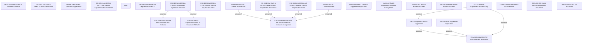

# CBL-12588 (CSI-545) Integrate DMS component with BSL CSI functions

```mermaid
graph TD
    n_08_407_Evaluate_CheckTL_fulfillment_common["08.407 Evaluate CheckTL fulfillment common"]
    CSI_1414_Use_DMS_in_CheckTL_service_evaluation["CSI-1414 Use DMS in CheckTL service evaluation"]
    Logical_Data_Model_Contract_Supplements["Logical Data Model : Contract Supplements"]
    CSI_1256_Use_DMS_in_UC13_190_Reprint_supplement_documentatio["CSI-1256 Use DMS in UC13.190 Reprint supplement documentation"]
    el_1728799["Note"]
    n_08_356_Generate_service_request_document_v2["08.356 Generate service request document v2"]
    CSI_1128_DMS_Extend_Find_Document_API_features["CSI-1128 DMS - Extend Find Document API features"]
    CSI_1127_DMS_Registration_check_as_Document_Attribute["CSI-1127 DMS - Registration check as Document Attribute"]
    CSI_1122_Use_DMS_in_Contract_Supplement_registration_functio["CSI-1122 Use DMS in Contract Supplement registration functions"]
    CSI_1120_Use_DMS_in_UC08_359_Print_service_request_document["CSI-1120 Use DMS in UC08.359 Print service request document"]
    CSI_1121_Use_DMS_in_13_205_Create_contract_supplement_docume["CSI-1121 Use DMS in 13.205 Create contract supplement documents"]
    CSI_1119_Use_DMS_in_UC_08_356_Generate_service_request_docum["CSI-1119 Use DMS in UC 08.356 Generate service request document"]
    Documents_v1_CreateDocument["Documents_v1 : CreateDocument"]
    DocumentFiles_v1_CreateDocumentFile["DocumentFiles_v1 : CreateDocumentFile"]
    CSI_1124_Extension_DMS_API_for_document_file_metadata_accept["CSI-1124 Extension DMS API for document file metadata acceptation"]
    UseCase_model_Contract_supplement_registration["UseCase model : Contract supplement registration"]
    UseCase_Model_Supplement_document_management["UseCase Model : Supplement document management"]
    n_08_359_Print_service_request_document["08.359 Print service request document"]
    n_08_356_Generate_service_request_document["08.356 Generate service request document"]
    n_13_271_Register_supplement_automatically["13.271 Register supplement automatically"]
    Generate_documents_list_for_supplement_registration["Generate documents list for supplement registration"]
    n_13_270_Register_Contract_supplement["13.270 Register Contract supplement"]
    n_13_190_Reprint_supplement_documentation["13.190 Reprint supplement documentation"]
    n_13_275_Show_supplement_registration["13.275 Show supplement registration"]
    DEL_13_205_Create_contract_supplement_documents["{DEL}13.205 Create contract supplement documents"]
    DEL_03_210_Print_ER_document["{DEL}03.210 Print ER document"]
    DocumentFiles_v1_CreateDocumentFile -->|unnamed| CSI_1124_Extension_DMS_API_for_document_file_metadata_accept
    CSI_1121_Use_DMS_in_13_205_Create_contract_supplement_docume -->|unnamed| CSI_1124_Extension_DMS_API_for_document_file_metadata_accept
    CSI_1119_Use_DMS_in_UC_08_356_Generate_service_request_docum -->|unnamed| CSI_1124_Extension_DMS_API_for_document_file_metadata_accept
    Documents_v1_CreateDocument -->|unnamed| CSI_1124_Extension_DMS_API_for_document_file_metadata_accept
    CSI_1122_Use_DMS_in_Contract_Supplement_registration_functio -->|unnamed| CSI_1127_DMS_Registration_check_as_Document_Attribute
    CSI_1122_Use_DMS_in_Contract_Supplement_registration_functio -->|unnamed| CSI_1128_DMS_Extend_Find_Document_API_features
    n_13_270_Register_Contract_supplement -->|unnamed| Generate_documents_list_for_supplement_registration
    n_13_275_Show_supplement_registration -->|unnamed| Generate_documents_list_for_supplement_registration
    n_13_271_Register_supplement_automatically -->|unnamed| n_13_270_Register_Contract_supplement
    n_13_271_Register_supplement_automatically -->|unnamed| Generate_documents_list_for_supplement_registration
```
