# CBL-12831 (CSI-617) Mandatory Life Insurance for REL

- **Diagram Type**: Custom
- **Package**: HomerSelect/BSL/Requirements Model/Finished/CSI/CBL-12831 (CSI-617) Mandatory Life Insurance for REL
- **Diagram ID**: 135905
- **Elements**: 15
- **Connectors**: 9

```mermaid
graph TD
    el_1878107["Note"]
    el_1603410["Note"]
    Use_Case_Model_Insurance_prolongation["Use Case Model : Insurance prolongation"]
    REQ_4_Limitation_of_the_mandatory_insurance_in_offering_and_["REQ #4 - Limitation of the mandatory insurance in offering and operation status change"]
    REQ_3_Prolongation_of_the_REL_mandatory_insurance["REQ #3 - Prolongation of the REL mandatory insurance"]
    Use_case_model_Deactivation_of_mandatory_insurance_upon_stan["Use case model : Deactivation of mandatory insurance upon standard insurance adding"]
    REQ_2_Deactivation_of_mandatory_insurance_on_standard_life_i["REQ #2 - Deactivation of mandatory insurance on standard life insurance adding"]
    el_1878105["Note"]
    REQ_1_Replacement_of_REL_insurance_based_on_defined_rules["REQ #1 - Replacement of REL insurance based on defined rules"]
    BSL_versions_Changing_insurance_operation_status["BSL versions : Changing insurance operation status"]
    Use_Case_Model_Adding_Insurance_Service_on_REL_contract["Use Case Model : Adding Insurance Service on REL contract"]
    Use_Case_Model_Insurance_Service_Offers_Use_Case_Model["Use Case Model : Insurance Service Offers - Use Case Model"]
    General_requirement_description["General requirement description"]
    Use_case_model_Replacement_of_standard_insurance_upon_its_ca["Use case model : Replacement of standard insurance upon its cancelation or termination"]
    el_1603416["Boundary"]
    REQ_4_Limitation_of_the_mandatory_insurance_in_offering_and_ -->|unnamed| General_requirement_description
    REQ_3_Prolongation_of_the_REL_mandatory_insurance -->|unnamed| General_requirement_description
    REQ_2_Deactivation_of_mandatory_insurance_on_standard_life_i -->|unnamed| General_requirement_description
    REQ_1_Replacement_of_REL_insurance_based_on_defined_rules -->|unnamed| General_requirement_description
    Use_case_model_Replacement_of_standard_insurance_upon_its_ca -->|unnamed| REQ_1_Replacement_of_REL_insurance_based_on_defined_rules
    Use_case_model_Deactivation_of_mandatory_insurance_upon_stan -->|unnamed| REQ_2_Deactivation_of_mandatory_insurance_on_standard_life_i
    Use_Case_Model_Insurance_prolongation -->|unnamed| REQ_3_Prolongation_of_the_REL_mandatory_insurance
    Use_Case_Model_Insurance_Service_Offers_Use_Case_Model -->|unnamed| REQ_4_Limitation_of_the_mandatory_insurance_in_offering_and_
    el_1878105 -->|unnamed| REQ_1_Replacement_of_REL_insurance_based_on_defined_rules
```

