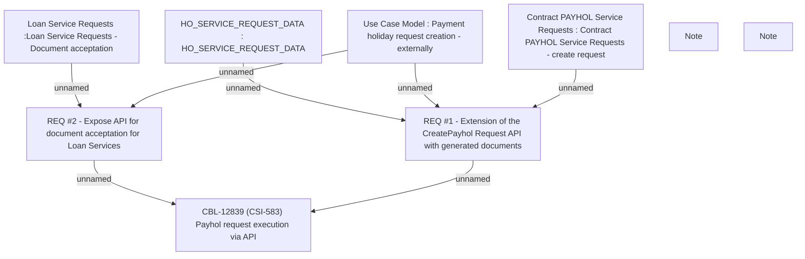

# CBL-12839 (CSI-583) Payhol request execution via API

```mermaid
graph TD
    Loan_Service_Requests_Loan_Service_Requests_Document_accepta["Loan Service Requests :Loan Service Requests - Document acceptation"]
    HO_SERVICE_REQUEST_DATA_HO_SERVICE_REQUEST_DATA["HO_SERVICE_REQUEST_DATA : HO_SERVICE_REQUEST_DATA"]
    REQ_2_Expose_API_for_document_acceptation_for_Loan_Services["REQ #2 - Expose API for document acceptation for Loan Services"]
    Use_Case_Model_Payment_holiday_request_creation_externally["Use Case Model : Payment holiday request creation - externally"]
    Contract_PAYHOL_Service_Requests_Contract_PAYHOL_Service_Req["Contract PAYHOL Service Requests : Contract PAYHOL Service Requests - create request"]
    el_1608964["Note"]
    REQ_1_Extension_of_the_CreatePayhol_Request_API_with_generat["REQ #1 - Extension of the CreatePayhol Request API with generated documents"]
    CBL_12839_CSI_583_Payhol_request_execution_via_API["CBL-12839 (CSI-583) Payhol request execution via API"]
    el_1608961["Note"]
    REQ_2_Expose_API_for_document_acceptation_for_Loan_Services -->|unnamed| CBL_12839_CSI_583_Payhol_request_execution_via_API
    REQ_1_Extension_of_the_CreatePayhol_Request_API_with_generat -->|unnamed| CBL_12839_CSI_583_Payhol_request_execution_via_API
    HO_SERVICE_REQUEST_DATA_HO_SERVICE_REQUEST_DATA -->|unnamed| REQ_1_Extension_of_the_CreatePayhol_Request_API_with_generat
    Use_Case_Model_Payment_holiday_request_creation_externally -->|unnamed| REQ_1_Extension_of_the_CreatePayhol_Request_API_with_generat
    Contract_PAYHOL_Service_Requests_Contract_PAYHOL_Service_Req -->|unnamed| REQ_1_Extension_of_the_CreatePayhol_Request_API_with_generat
    Loan_Service_Requests_Loan_Service_Requests_Document_accepta -->|unnamed| REQ_2_Expose_API_for_document_acceptation_for_Loan_Services
    Use_Case_Model_Payment_holiday_request_creation_externally -->|unnamed| REQ_2_Expose_API_for_document_acceptation_for_Loan_Services
```
