# CBL-13063 (CSI-631) Set up Loan Purpose & Registration process for ALOP

- **Diagram Type**: Custom
- **Package**: HomerSelect/BSL/Requirements Model/Finished/CSI/CBL-13063 (CSI-631) Set up Loan Purpose & Registration process for ALOP
- **Diagram ID**: 137237
- **Elements**: 13
- **Connectors**: 12

```mermaid
graph TD
    Web_Services_Loan_on_Phone_ALOP_Accept_ALOP_document["Web Services : Loan on Phone (ALOP) - Accept ALOP document"]
    Use_case_model_Advanced_Cash_on_Card_ALOP_documents_Use_case["Use case model : Advanced Cash on Card (ALOP) documents - Use case model "]
    Contract_Supplement_screen_flow_Contract_Supplement_screen_f["Contract Supplement screen flow : Contract Supplement screen flow"]
    User_Interface_model_ALOP_Contract_supplement_detail["User Interface model : ALOP Contract supplement detail"]
    REQ_2_Registration_of_ALOP_documents["REQ #2 - Registration of ALOP documents"]
    REQ_3_Contract_Supplement_documents_for_ALOP["REQ #3 - Contract Supplement documents for ALOP"]
    REQ_1_ALOP_transaction_detail_screen["REQ #1 - ALOP transaction detail screen"]
    Tab_Contract_supplements_Tab_Contract_supplements["Tab-Contract supplements : Tab-Contract supplements"]
    UseCase_Model_Supplement_document_management["UseCase Model : Supplement document management"]
    UseCase_model_Contract_supplement_registration["UseCase model : Contract supplement registration"]
    User_interface_model_Contract_supplement_registration["User interface model : Contract supplement registration"]
    General_list_of_requirements_involved_in_this_solution_desig["General list of requirements involved in this solution design"]
    User_Interface_Model_Tab_Collection_tools_requests_managemen["User Interface Model : Tab - Collection tools requests management"]
    Contract_Supplement_screen_flow_Contract_Supplement_screen_f -->|unnamed| General_list_of_requirements_involved_in_this_solution_desig
    REQ_2_Registration_of_ALOP_documents -->|unnamed| General_list_of_requirements_involved_in_this_solution_desig
    REQ_3_Contract_Supplement_documents_for_ALOP -->|unnamed| General_list_of_requirements_involved_in_this_solution_desig
    REQ_1_ALOP_transaction_detail_screen -->|unnamed| General_list_of_requirements_involved_in_this_solution_desig
    User_Interface_model_ALOP_Contract_supplement_detail -->|unnamed| REQ_1_ALOP_transaction_detail_screen
    Tab_Contract_supplements_Tab_Contract_supplements -->|unnamed| REQ_1_ALOP_transaction_detail_screen
    User_Interface_Model_Tab_Collection_tools_requests_managemen -->|unnamed| REQ_1_ALOP_transaction_detail_screen
    UseCase_Model_Supplement_document_management -->|unnamed| REQ_3_Contract_Supplement_documents_for_ALOP
    Web_Services_Loan_on_Phone_ALOP_Accept_ALOP_document -->|unnamed| REQ_2_Registration_of_ALOP_documents
    Use_case_model_Advanced_Cash_on_Card_ALOP_documents_Use_case -->|unnamed| REQ_2_Registration_of_ALOP_documents
    UseCase_model_Contract_supplement_registration -->|unnamed| REQ_2_Registration_of_ALOP_documents
    User_interface_model_Contract_supplement_registration -->|unnamed| REQ_2_Registration_of_ALOP_documents
```

