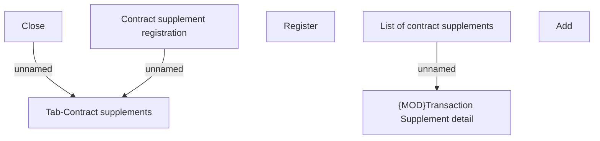

# Contract Supplement screen flow

- **Diagram Type**: Custom
- **Package**: HomerSelect/BSL/Requirements Model/Finished/CSI/CBL-13063 (CSI-631) Set up Loan Purpose & Registration process for ALOP/Contract Supplement screen flow
- **Diagram ID**: 136892
- **Elements**: 7
- **Connectors**: 3

