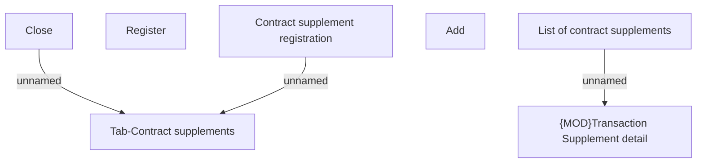

# Contract Supplement screen flow

```mermaid
graph TD
    Close["Close"]
    Register["Register"]
    MOD_Transaction_Supplement_detail["{MOD}Transaction Supplement detail"]
    List_of_contract_supplements["List of contract supplements"]
    Add["Add"]
    Tab_Contract_supplements["Tab-Contract supplements"]
    Contract_supplement_registration["Contract supplement registration"]
    Close -->|unnamed| Tab_Contract_supplements
    List_of_contract_supplements -->|unnamed| MOD_Transaction_Supplement_detail
    Contract_supplement_registration -->|unnamed| Tab_Contract_supplements
```
