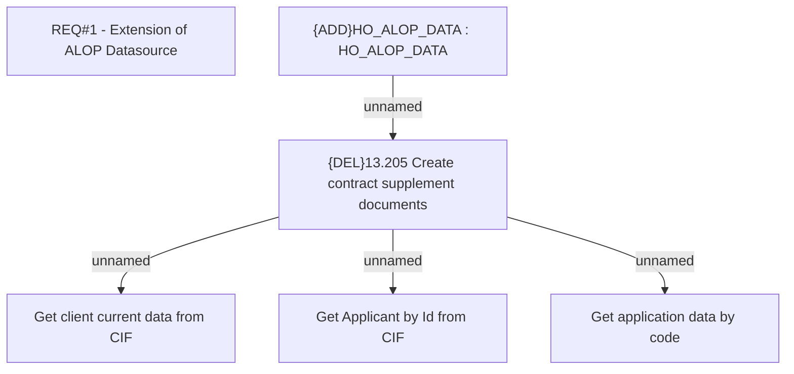

# Extension of ALOP datasource

```mermaid
graph TD
    REQ_1_Extension_of_ALOP_Datasource["REQ#1 - Extension of ALOP Datasource "]
    Get_Applicant_by_Id_from_CIF["Get Applicant by Id from CIF"]
    Get_application_data_by_code["Get application data by code"]
    ADD_HO_ALOP_DATA_HO_ALOP_DATA["{ADD}HO_ALOP_DATA : HO_ALOP_DATA"]
    Get_client_current_data_from_CIF["Get client current data from CIF"]
    DEL_13_205_Create_contract_supplement_documents["{DEL}13.205 Create contract supplement documents"]
    DEL_13_205_Create_contract_supplement_documents -->|unnamed| Get_client_current_data_from_CIF
    DEL_13_205_Create_contract_supplement_documents -->|unnamed| Get_Applicant_by_Id_from_CIF
    DEL_13_205_Create_contract_supplement_documents -->|unnamed| Get_application_data_by_code
    ADD_HO_ALOP_DATA_HO_ALOP_DATA -->|unnamed| DEL_13_205_Create_contract_supplement_documents
```
