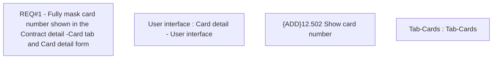

# CBL-13178 (CSI-690) Separate UI privilege for showing of Card number

```mermaid
graph TD
    REQ_1_Fully_mask_card_number_shown_in_the_Contract_detail_Ca["REQ#1 - Fully mask card number shown in the Contract detail -Card tab and Card detail form"]
    User_interface_Card_detail_User_interface["User interface : Card detail - User interface"]
    ADD_12_502_Show_card_number["{ADD}12.502 Show card number"]
    Tab_Cards_Tab_Cards["Tab-Cards : Tab-Cards"]
```
