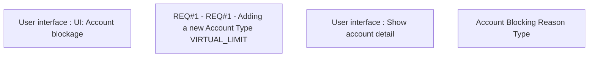

# CBL-13263 (CSI-661) New Account Type - Virtual Limit

- **Diagram Type**: Custom
- **Package**: HomerSelect/BSL/Requirements Model/Finished/CSI/CBL-13263 (CSI-661) New Account Type - Virtual Limit
- **Diagram ID**: 137243
- **Elements**: 4
- **Connectors**: 0

