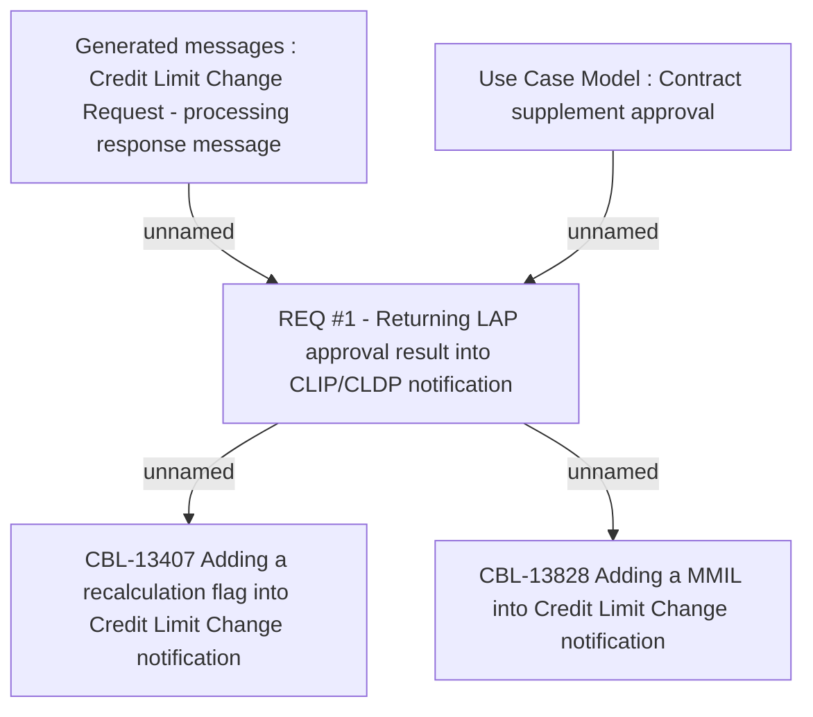

# CBL-13407 Provide capability to Blaze to create another CLIP offer if previous one was cancelled by Blaze

- **Diagram Type**: Custom
- **Package**: HomerSelect/BSL/Requirements Model/Finished/CSI/CBL-13407 Provide capability to Blaze to create another CLIP offer if previous one was cancelled by Blaze
- **Diagram ID**: 137545
- **Elements**: 5
- **Connectors**: 4

