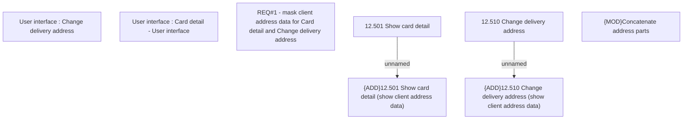

# CBL-14153 (CSI-863) Masking of Personal data

```mermaid
graph TD
    User_interface_Change_delivery_address["User interface : Change delivery address"]
    User_interface_Card_detail_User_interface["User interface : Card detail - User interface"]
    REQ_1_mask_client_address_data_for_Card_detail_and_Change_de["REQ#1 - mask client address data for Card detail and Change delivery address"]
    n_12_501_Show_card_detail["12.501 Show card detail"]
    n_12_510_Change_delivery_address["12.510 Change delivery address"]
    ADD_12_510_Change_delivery_address_show_client_address_data["{ADD}12.510 Change delivery address (show client address data)"]
    MOD_Concatenate_address_parts["{MOD}Concatenate address parts"]
    ADD_12_501_Show_card_detail_show_client_address_data["{ADD}12.501 Show card detail (show client address data)"]
    n_12_501_Show_card_detail -->|unnamed| ADD_12_501_Show_card_detail_show_client_address_data
    n_12_510_Change_delivery_address -->|unnamed| ADD_12_510_Change_delivery_address_show_client_address_data
```
