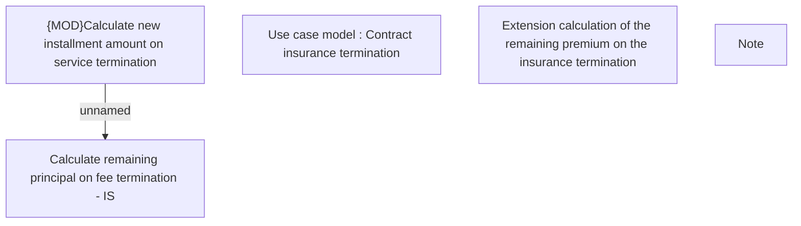

# CBL-14272 (CSI-1000) Update Termination Feature for Regular and Upfront Insurance

```mermaid
graph TD
    Calculate_remaining_principal_on_fee_termination_IS["Calculate remaining principal on fee termination - IS"]
    MOD_Calculate_new_installment_amount_on_service_termination["{MOD}Calculate new installment amount on service termination"]
    Use_case_model_Contract_insurance_termination["Use case model : Contract insurance termination"]
    Extension_calculation_of_the_remaining_premium_on_the_insura["Extension calculation of the remaining premium on the insurance termination"]
    el_1637937["Note"]
    MOD_Calculate_new_installment_amount_on_service_termination -->|unnamed| Calculate_remaining_principal_on_fee_termination_IS
```
