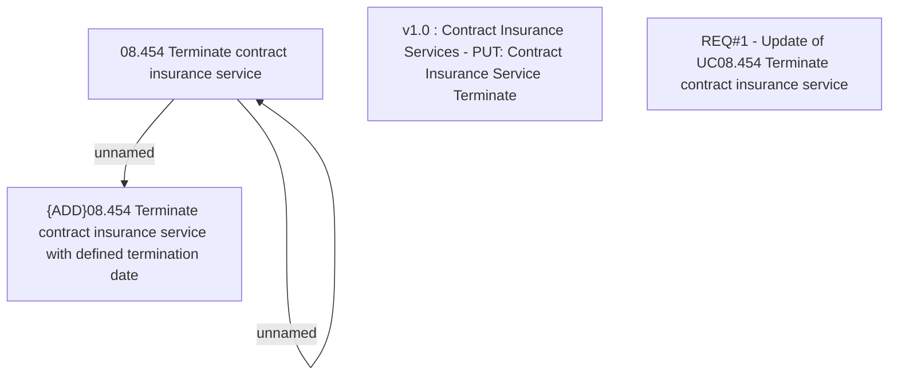

# CBL-14503 (CSI-1407) Insurance termination API - add TerminationDate input parameter

- **Diagram Type**: Custom
- **Package**: HomerSelect/BSL/Requirements Model/Finished/CSI/CBL-14503 (CSI-1407) Insurance termination API - add TerminationDate input parameter
- **Diagram ID**: 141837
- **Elements**: 5
- **Connectors**: 2

