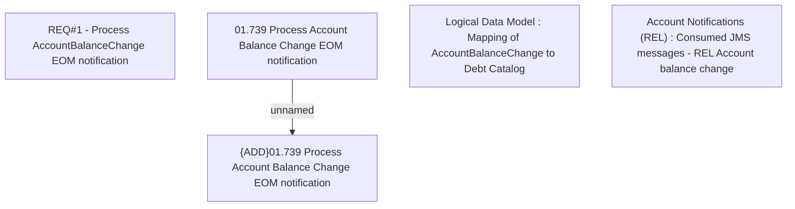

# CBL-16042 (CSI-1090) Replace EOMBillingFinishedSE by processing of AccountBalanceChange

- **Diagram Type**: Custom
- **Package**: HomerSelect/BSL/Requirements Model/Finished/CSI/CBL-16042 (CSI-1090) Replace EOMBillingFinishedSE by processing of AccountBalanceChange
- **Diagram ID**: 142359
- **Elements**: 5
- **Connectors**: 1

