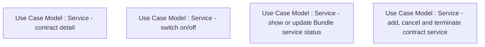

# CBL-16152 (CSI-1340) Contract service modularization - analysis

- **Diagram Type**: Custom
- **Package**: HomerSelect/BSL/Requirements Model/Finished/CSI/CBL-16152 (CSI-1340) Contract service modularization - analysis
- **Diagram ID**: 151165
- **Elements**: 4
- **Connectors**: 0

