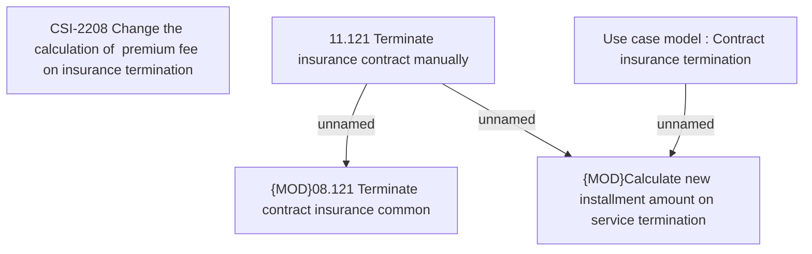

# CBL-16453 (CSI-2123) Change the calculation of refunding fee when customer ET

- **Diagram Type**: Custom
- **Package**: HomerSelect/BSL/Requirements Model/Finished/CSI/CBL-16453 (CSI-2123) Change the calculation of refunding fee when customer ET
- **Diagram ID**: 149104
- **Elements**: 5
- **Connectors**: 3

