# CBL-16491 (CSI-1432) VN BNPL - Document generation for BNPL transaction

- **Diagram Type**: Custom
- **Package**: HomerSelect/BSL/Requirements Model/Finished/CSI/CBL-16491 (CSI-1432) VN BNPL - Document generation for BNPL transaction
- **Diagram ID**: 154189
- **Elements**: 24
- **Connectors**: 22

```mermaid
graph TD
    Requirement1["Requirement1"]
    Transaction_Supplement_Notifications_Contract_Supplement_Not["Transaction Supplement Notifications : Contract Supplement Notifications"]
    CSI_1554_Changes_in_Transaction_Supplement_datasource["CSI-1554 - Changes in Transaction Supplement datasource"]
    Tab_Contract_supplements_Tab_Contract_supplements["Tab-Contract supplements : Tab-Contract supplements"]
    User_Interface_model_Transaction_Supplement_detail["User Interface model : Transaction Supplement detail"]
    CSI_1516_Transaction_Supplements_management["CSI-1516 - Transaction Supplements management"]
    Web_Services_Contract_Supplements_Get_Transaction_type_Suppl["Web Services :Contract Supplements - Get Transaction type Supplement by CUID"]
    Web_Services_Transaction_Supplement_Get_Transaction_Suppleme["Web Services : Transaction Supplement - Get Transaction Supplement"]
    Use_case_model_Transaction_Supplement_authorization_confirma["Use case model : Transaction Supplement authorization/confirmation - Use case model"]
    CSI_1506_Getting_information_about_Transaction_Supplements["CSI-1506 - Getting information about Transaction Supplements"]
    Web_Services_Transaction_Supplement_Accept_Transaction_Suppl["Web Services : Transaction Supplement - Accept Transaction Supplement document"]
    Web_Services_Transaction_Supplement_Create_Transaction_Suppl["Web Services : Transaction Supplement - Create Transaction Supplement"]
    CSI_1533_TransactionSupplement_notification_through_outbox["CSI-1533 - TransactionSupplement notification through outbox"]
    Logical_data_model_Transaction_Supplement_processing_Logical["Logical data model :Transaction Supplement processing - Logical data model"]
    Supplement_for_Transaction_Supplement_definition["Supplement for Transaction Supplement definition"]
    Logical_data_model_Loan_on_card_ALOP_definition_Logical_data["Logical data model : Loan on card (ALOP) definition - Logical data model"]
    Processing_Cardless_Transaction_request_Processing_Cardless_["Processing Cardless Transaction request : Processing Cardless Transaction request (BL)"]
    ADD_HO_ALOP_DATA_HO_ALOP_DATA["{ADD}HO_ALOP_DATA : HO_ALOP_DATA"]
    Use_case_model_Transaction_Supplement_documents_Use_case_mod["Use case model :Transaction Supplement documents - Use case model "]
    Use_case_model_Transaction_Supplement_request_creation_Use_c["Use case model :Transaction Supplement request creation - Use case model"]
    VN_BNPL_Document_generation_for_BNPL_transaction["VN BNPL - Document generation for BNPL transaction"]
    CSI_1469_Update_transaction_supplement_data_source_for_print["CSI-1469 - Update transaction supplement data source for printouts"]
    CSI_1497_Creation_of_transaction_by_type_of_Transaction_Supp["CSI-1497 - Creation of transaction by type of Transaction Supplement"]
    CSI_1455_Create_Transaction_Supplement_function["CSI-1455 - Create Transaction Supplement function"]
    CSI_1506_Getting_information_about_Transaction_Supplements -->|unnamed| VN_BNPL_Document_generation_for_BNPL_transaction
    Tab_Contract_supplements_Tab_Contract_supplements -->|unnamed| CSI_1516_Transaction_Supplements_management
    Web_Services_Transaction_Supplement_Get_Transaction_Suppleme -->|unnamed| CSI_1506_Getting_information_about_Transaction_Supplements
    Web_Services_Contract_Supplements_Get_Transaction_type_Suppl -->|unnamed| CSI_1506_Getting_information_about_Transaction_Supplements
    Transaction_Supplement_Notifications_Contract_Supplement_Not -->|unnamed| CSI_1533_TransactionSupplement_notification_through_outbox
    Logical_data_model_Loan_on_card_ALOP_definition_Logical_data -->|unnamed| Supplement_for_Transaction_Supplement_definition
    CSI_1533_TransactionSupplement_notification_through_outbox -->|unnamed| VN_BNPL_Document_generation_for_BNPL_transaction
    CSI_1497_Creation_of_transaction_by_type_of_Transaction_Supp -->|unnamed| VN_BNPL_Document_generation_for_BNPL_transaction
    CSI_1469_Update_transaction_supplement_data_source_for_print -->|unnamed| VN_BNPL_Document_generation_for_BNPL_transaction
    User_Interface_model_Transaction_Supplement_detail -->|unnamed| CSI_1516_Transaction_Supplements_management
    CSI_1516_Transaction_Supplements_management -->|unnamed| VN_BNPL_Document_generation_for_BNPL_transaction
    Web_Services_Transaction_Supplement_Create_Transaction_Suppl -->|unnamed| CSI_1455_Create_Transaction_Supplement_function
    Processing_Cardless_Transaction_request_Processing_Cardless_ -->|unnamed| VN_BNPL_Document_generation_for_BNPL_transaction
    Supplement_for_Transaction_Supplement_definition -->|unnamed| VN_BNPL_Document_generation_for_BNPL_transaction
    CSI_1455_Create_Transaction_Supplement_function -->|unnamed| VN_BNPL_Document_generation_for_BNPL_transaction
    Web_Services_Transaction_Supplement_Accept_Transaction_Suppl -->|unnamed| CSI_1469_Update_transaction_supplement_data_source_for_print
    ADD_HO_ALOP_DATA_HO_ALOP_DATA -->|unnamed| CSI_1469_Update_transaction_supplement_data_source_for_print
    Use_case_model_Transaction_Supplement_documents_Use_case_mod -->|unnamed| CSI_1469_Update_transaction_supplement_data_source_for_print
    Use_case_model_Transaction_Supplement_authorization_confirma -->|unnamed| CSI_1497_Creation_of_transaction_by_type_of_Transaction_Supp
    Logical_data_model_Transaction_Supplement_processing_Logical -->|unnamed| CSI_1455_Create_Transaction_Supplement_function
    Use_case_model_Transaction_Supplement_request_creation_Use_c -->|unnamed| CSI_1455_Create_Transaction_Supplement_function
    CSI_1554_Changes_in_Transaction_Supplement_datasource -->|unnamed| VN_BNPL_Document_generation_for_BNPL_transaction
```

