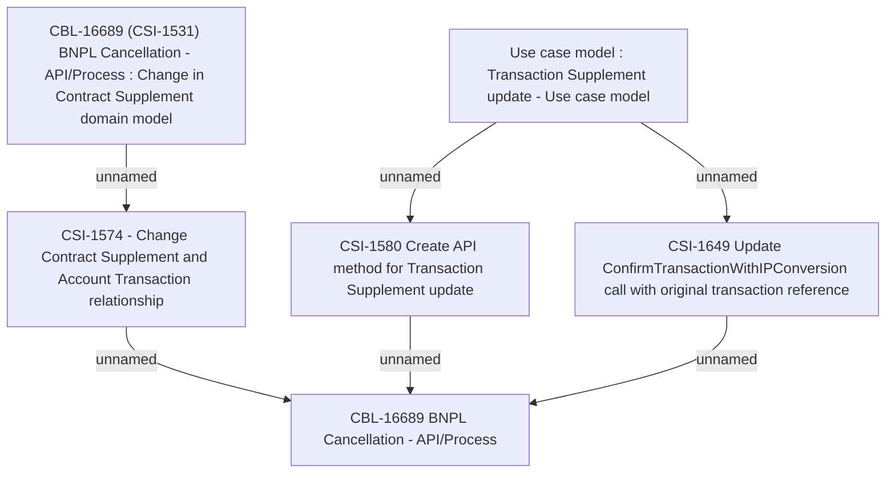

# CBL-16689 (CSI-1531) BNPL Cancellation - API/Process

- **Diagram Type**: Custom
- **Package**: HomerSelect/BSL/Requirements Model/Finished/CSI/CBL-16689 (CSI-1531) BNPL Cancellation - API/Process
- **Diagram ID**: 159739
- **Elements**: 6
- **Connectors**: 6

