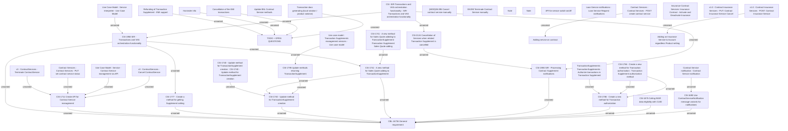

# CBL-16736 (CSI-1550) EMI Card - VAS as a service -Termination

```mermaid
graph TD
    CSI_2124_Cancellation_of_Services_when_related_Transaction_S["CSI-2124 Cancellation of Services when related Transaction Supplement is cancelled"]
    Refunding_of_Transaction_Supplement_EMI_support["Refunding of Transaction Supplement - EMI support"]
    Harvinder_info["Harvinder info"]
    Cancellation_of_the_EMI_transactions["Cancellation of the EMI transactions"]
    Transaction_docs_generating_local_solution_product_solution["Transaction docs generating (local solution / product solution)"]
    TODO_OPEN_QUESTIONS["TODO + OPEN QUESTIONS"]
    Update_BSL_Contract_Service_methods["Update BSL Contract Service methods"]
    Use_Case_Model_Service_Interpreter_Use_Case_Model["Use Case Model : Service Interpreter - Use Case Model"]
    CSI_1875_Calling_INSR_data_eligibility_with_CUID["CSI-1875 Calling INSR data eligibility with CUID"]
    CSI_1786_Create_a_new_method_for_Transaction_authorization_T["CSI-1786 - Create a new method for Transaction authorization : Transaction Supplement authorization method"]
    Use_case_model_Transaction_Supplements_management_services_U["Use case model : Transaction Supplements management services - Use case model"]
    CSI_1795_Update_methods_returning_TransactionSupplement["CSI-1795 Update methods returning TransactionSupplement"]
    CSI_1986_SIR_Processing_Contract_Supplement_notifications["CSI-1986 SIR - Processing Contract Supplement notifications"]
    TransactionSupplements_TransactionSupplements_Authorize_tran["TransactionSupplements : TransactionSupplements - Authorize transactions in Transaction Supplement"]
    CSI_1786_Create_a_new_method_for_Transaction_authorization_T["CSI-1786 - Create a new method for Transaction authorization : Transaction Supplement authorization method"]
    CSI_1786_Create_a_new_method_for_Transaction_authorization["CSI-1786 - Create a new method for Transaction authorization"]
    CSI_SIR_Transactions_and_VAS_orchestration_functionality_SIR["CSI -SIR-Transactions and VAS orchestration functionality : SIR-Transactions and VAS orchestration functionality"]
    CSI_1777_Create_a_method_for_getting_Supplement_setting["CSI-1777 - Create a method for getting Supplement setting"]
    CSI_1741_A_new_method_for_Sales_Quote_addidng_to_Transaction["CSI-1741 - A new method for Sales Quote addidng to TransactionSupplement :Transaction Supplement Sales Quote adding"]
    CSI_1740_Update_method_for_TransactionSupplement_creation_CS["CSI-1740 - Update method for TransactionSupplement creation : CSI-1740 - Update method for TransactionSupplement creation"]
    CSI_1950_SIR_Transactions_and_VAS_orchestration_functionalit["CSI-1950 SIR - Transactions and VAS orchestration functionality"]
    CSI_1741_A_new_method_for_Sales_Quote_adding_to_TransactionS["CSI-1741 - A new method for Sales Quote adding to TransactionSupplement"]
    CSI_1740_Update_method_for_TransactionSupplement_creation["CSI-1740 - Update method for TransactionSupplement creation"]
    v3_ContractServices_Terminate_ContractService["v3 : ContractServices - Terminate ContractService"]
    v3_ContractServices_Cancel_ContractService["v3 : ContractServices - Cancel ContractService"]
    Use_Case_Model_Service_Contract_Service_management_via_API["Use Case Model : Service - Contract Service management via API"]
    MOD_08_095_Cancel_contract_service_manually["{MOD}08.095 Cancel contract service manually"]
    n_08_090_Terminate_Contract_Service_manually["08.090 Terminate Contract Service manually"]
    CSI_1711_Create_API_for_Contract_Service_management["CSI-1711 Create API for Contract Service management"]
    el_1826899["Note"]
    el_1826892["Note"]
    API_for_service_switch_on_off["API for service switch-on/off"]
    Contract_Service_notification_Contract_Service_notification["Contract Service notification : Contract Service notification"]
    Loan_Service_notifications_Loan_Service_Request_notification["Loan Service notifications : Loan Service Request notifications"]
    Contract_Services_Contract_Services_PUT_set_contract_service["Contract Services : Contract Services - PUT set contract service status"]
    Contract_Services_Contract_Services_POST_create_contract_ser["Contract Services : Contract Services - POST create contract service"]
    Adding_service_on_contract["Adding service on contract"]
    Insurance_Contract_Services_Insurance_Contract_Activate_and_["Insurance Contract Services :Insurance Contract - Activate and Deactivate Insurance"]
    v1_0_Contract_Insurance_Services_PUT_Contract_Insurance_Serv["v1.0 : Contract Insurance Services - PUT: Contract Insurance Service Terminate"]
    v1_0_Contract_Insurance_Services_PUT_Contract_Insurance_Serv["v1.0 : Contract Insurance Services - PUT: Contract Insurance Service Cancel"]
    v1_0_Contract_Insurance_Services_POST_Contract_Insurance_Ser["v1.0 : Contract Insurance Services - POST: Contract Insurance Service"]
    Adding_an_Insurance_Service_to_Account_regardless_Product_se["Adding an Insurance Service to Account regardless Product setting"]
    CSI_1690_Use_ContractServiceNotification_message_variants_fo["CSI-1690 Use ContractServiceNotification message variants for notificationsOOO"]
    CBL_16736_General_requirement["CBL-16736 General requirement"]
    CSI_1690_Use_ContractServiceNotification_message_variants_fo["CSI-1690 Use ContractServiceNotification message variants for notifications"]
    CSI_2124_Cancellation_of_Services_when_related_Transaction_S -->|unnamed| CSI_1986_SIR_Processing_Contract_Supplement_notifications
    CSI_1950_SIR_Transactions_and_VAS_orchestration_functionalit -->|unnamed| CSI_1741_A_new_method_for_Sales_Quote_adding_to_TransactionS
    CSI_1741_A_new_method_for_Sales_Quote_addidng_to_Transaction -->|unnamed| CSI_1741_A_new_method_for_Sales_Quote_adding_to_TransactionS
    Use_Case_Model_Service_Interpreter_Use_Case_Model -->|unnamed| CSI_1950_SIR_Transactions_and_VAS_orchestration_functionalit
    CSI_SIR_Transactions_and_VAS_orchestration_functionality_SIR -->|unnamed| CSI_1950_SIR_Transactions_and_VAS_orchestration_functionalit
    CSI_1950_SIR_Transactions_and_VAS_orchestration_functionalit -->|unnamed| CSI_1777_Create_a_method_for_getting_Supplement_setting
    TransactionSupplements_TransactionSupplements_Authorize_tran -->|unnamed| CSI_1786_Create_a_new_method_for_Transaction_authorization
    CSI_SIR_Transactions_and_VAS_orchestration_functionality_SIR -->|unnamed| CSI_2124_Cancellation_of_Services_when_related_Transaction_S
    CSI_1786_Create_a_new_method_for_Transaction_authorization_T -->|unnamed| CSI_1786_Create_a_new_method_for_Transaction_authorization
    CSI_1740_Update_method_for_TransactionSupplement_creation_CS -->|unnamed| CSI_1740_Update_method_for_TransactionSupplement_creation
    CSI_SIR_Transactions_and_VAS_orchestration_functionality_SIR -->|unnamed| CSI_1986_SIR_Processing_Contract_Supplement_notifications
    Use_case_model_Transaction_Supplements_management_services_U -->|unnamed| CSI_1795_Update_methods_returning_TransactionSupplement
    Refunding_of_Transaction_Supplement_EMI_support -->|unnamed| TODO_OPEN_QUESTIONS
    Harvinder_info -->|unnamed| TODO_OPEN_QUESTIONS
    Cancellation_of_the_EMI_transactions -->|unnamed| TODO_OPEN_QUESTIONS
    Transaction_docs_generating_local_solution_product_solution -->|unnamed| TODO_OPEN_QUESTIONS
    CSI_1786_Create_a_new_method_for_Transaction_authorization_T -->|unnamed| CSI_1786_Create_a_new_method_for_Transaction_authorization
    Contract_Service_notification_Contract_Service_notification -->|unnamed| CSI_1690_Use_ContractServiceNotification_message_variants_fo
    CSI_1950_SIR_Transactions_and_VAS_orchestration_functionalit -->|unnamed| CBL_16736_General_requirement
    CSI_1711_Create_API_for_Contract_Service_management -->|unnamed| CBL_16736_General_requirement
    CSI_1777_Create_a_method_for_getting_Supplement_setting -->|unnamed| CBL_16736_General_requirement
    CSI_1740_Update_method_for_TransactionSupplement_creation -->|unnamed| CBL_16736_General_requirement
    CSI_1741_A_new_method_for_Sales_Quote_adding_to_TransactionS -->|unnamed| CBL_16736_General_requirement
    CSI_1986_SIR_Processing_Contract_Supplement_notifications -->|unnamed| CBL_16736_General_requirement
    CSI_1741_A_new_method_for_Sales_Quote_adding_to_TransactionS -->|unnamed| CSI_1740_Update_method_for_TransactionSupplement_creation
    CSI_1786_Create_a_new_method_for_Transaction_authorization -->|unnamed| CBL_16736_General_requirement
    CSI_1795_Update_methods_returning_TransactionSupplement -->|unnamed| CSI_1740_Update_method_for_TransactionSupplement_creation
    v1_0_Contract_Insurance_Services_POST_Contract_Insurance_Ser -->|unnamed| Adding_an_Insurance_Service_to_Account_regardless_Product_se
    Contract_Services_Contract_Services_POST_create_contract_ser -->|unnamed| Adding_service_on_contract
    v3_ContractServices_Terminate_ContractService -->|unnamed| CSI_1711_Create_API_for_Contract_Service_management
    Contract_Services_Contract_Services_PUT_set_contract_service -->|unnamed| CSI_1711_Create_API_for_Contract_Service_management
    Use_Case_Model_Service_Contract_Service_management_via_API -->|unnamed| CSI_1711_Create_API_for_Contract_Service_management
    v3_ContractServices_Cancel_ContractService -->|unnamed| CSI_1711_Create_API_for_Contract_Service_management
    CSI_1875_Calling_INSR_data_eligibility_with_CUID -->|unnamed| CBL_16736_General_requirement
    CSI_1690_Use_ContractServiceNotification_message_variants_fo -->|unnamed| CBL_16736_General_requirement
```
