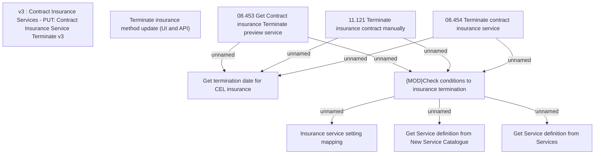

# CSI-1904 Update of the Terminate insurance method for new Service Catalogue

```mermaid
graph TD
    Get_Service_definition_from_New_Service_Catalogue["Get Service definition from New Service Catalogue"]
    Get_Service_definition_from_Services["Get Service definition from Services"]
    v3_Contract_Insurance_Services_PUT_Contract_Insurance_Servic["v3 : Contract Insurance Services - PUT: Contract Insurance Service Terminate v3"]
    Terminate_insurance_method_update_UI_and_API["Terminate insurance method update (UI and API)"]
    Get_termination_date_for_CEL_insurance["Get termination date for CEL insurance"]
    n_08_453_Get_Contract_insurance_Terminate_preview_service["08.453 Get Contract insurance Terminate preview service"]
    n_08_454_Terminate_contract_insurance_service["08.454 Terminate contract insurance service"]
    Insurance_service_setting_mapping["Insurance service setting mapping"]
    MOD_Check_conditions_to_insurance_termination["{MOD}Check conditions to insurance termination"]
    n_11_121_Terminate_insurance_contract_manually["11.121 Terminate insurance contract manually"]
    MOD_Check_conditions_to_insurance_termination -->|unnamed| Insurance_service_setting_mapping
    MOD_Check_conditions_to_insurance_termination -->|unnamed| Get_Service_definition_from_New_Service_Catalogue
    MOD_Check_conditions_to_insurance_termination -->|unnamed| Get_Service_definition_from_Services
    n_08_453_Get_Contract_insurance_Terminate_preview_service -->|unnamed| MOD_Check_conditions_to_insurance_termination
    n_08_453_Get_Contract_insurance_Terminate_preview_service -->|unnamed| Get_termination_date_for_CEL_insurance
    n_11_121_Terminate_insurance_contract_manually -->|unnamed| Get_termination_date_for_CEL_insurance
    n_11_121_Terminate_insurance_contract_manually -->|unnamed| MOD_Check_conditions_to_insurance_termination
    n_08_454_Terminate_contract_insurance_service -->|unnamed| MOD_Check_conditions_to_insurance_termination
    n_08_454_Terminate_contract_insurance_service -->|unnamed| Get_termination_date_for_CEL_insurance
```
