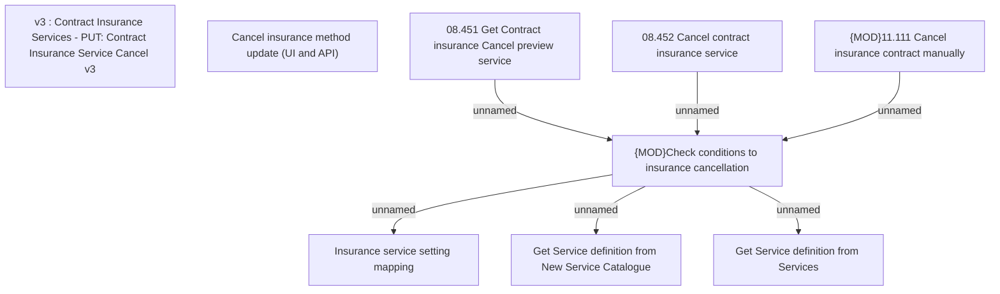

# CSI-1905 Update of the Cancel Insurance method for new Service Catalogue

- **Diagram Type**: Custom
- **Package**: HomerSelect/BSL/Requirements Model/Finished/CSI/CBL-16736 (CSI-1550) EMI Card - VAS as a service -Termination/Update BSL Contract Service methods/CSI-1905 Update of the Cancel Insurance method for new Service Catalogue
- **Diagram ID**: 146213
- **Elements**: 9
- **Connectors**: 6

