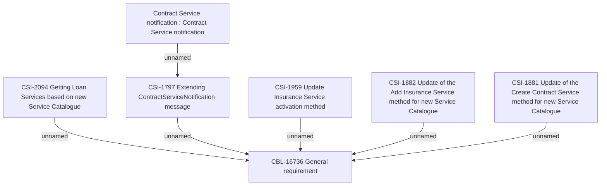

# Update BSL Contract Service methods

- **Diagram Type**: Custom
- **Package**: HomerSelect/BSL/Requirements Model/Finished/CSI/CBL-16736 (CSI-1550) EMI Card - VAS as a service -Termination/Update BSL Contract Service methods
- **Diagram ID**: 148163
- **Elements**: 7
- **Connectors**: 6

