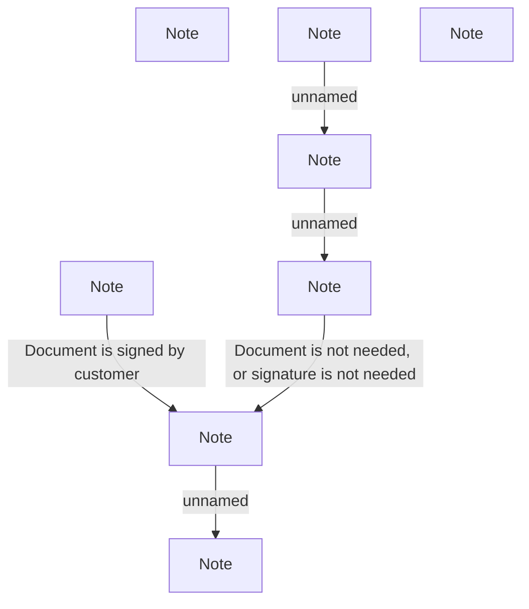

# VAS object model

```mermaid
graph TD
    el_1755919["Note"]
    el_1755924["Note"]
    el_1755923["Note"]
    el_1755920["Note"]
    el_1755912["Note"]
    el_1755910["Note"]
    el_1755914["Note"]
    el_1755916["Note"]
    el_1755914 -->|unnamed| el_1755920
    el_1755920 -->|unnamed| el_1755912
    el_1755923 -->|Document is signed by customer| el_1755919
    el_1755912 -->|Document is not needed, or signature is not needed| el_1755919
    el_1755919 -->|unnamed| el_1755924
```
