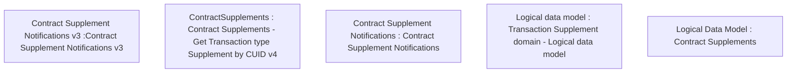

# CBL-16769 (CSI-1803) Kafka Streaming - ContractSuplement

```mermaid
graph TD
    Contract_Supplement_Notifications_v3_Contract_Supplement_Not["Contract Supplement Notifications v3 :Contract Supplement Notifications v3"]
    ContractSupplements_Contract_Supplements_Get_Transaction_typ["ContractSupplements : Contract Supplements - Get Transaction type Supplement by CUID v4"]
    Contract_Supplement_Notifications_Contract_Supplement_Notifi["Contract Supplement Notifications : Contract Supplement Notifications"]
    Logical_data_model_Transaction_Supplement_domain_Logical_dat["Logical data model : Transaction Supplement domain - Logical data model"]
    Logical_Data_Model_Contract_Supplements["Logical Data Model : Contract Supplements"]
```
