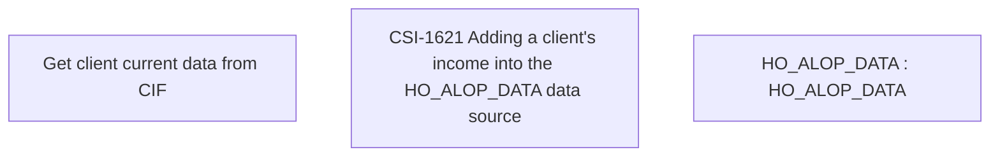

# CBL-17031 (CSI-1608) VN BNPL - Additional data of Document generation for BNPL transaction

- **Diagram Type**: Custom
- **Package**: HomerSelect/BSL/Requirements Model/Finished/CSI/CBL-17031 (CSI-1608) VN BNPL - Additional data of Document generation for BNPL transaction
- **Diagram ID**: 144396
- **Elements**: 3
- **Connectors**: 0

