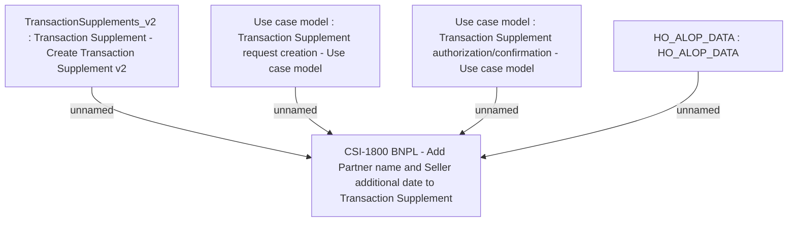

# CBL-17318 (CSI-1688) BNPL - Use Merchant in transaction attribute

- **Diagram Type**: Custom
- **Package**: HomerSelect/BSL/Requirements Model/Finished/CSI/CBL-17318 (CSI-1688) BNPL - Use Merchant in transaction attribute
- **Diagram ID**: 145952
- **Elements**: 5
- **Connectors**: 4

