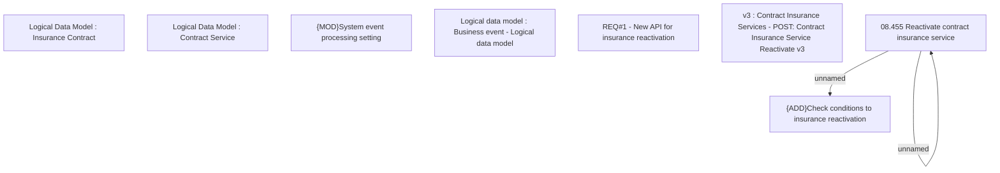

# CBL-17686 (CSI-2071) Add feature for re-activation of insurance contract

- **Diagram Type**: Custom
- **Package**: HomerSelect/BSL/Requirements Model/Finished/CSI/CBL-17686 (CSI-2071) Add feature for re-activation of insurance contract
- **Diagram ID**: 148013
- **Elements**: 9
- **Connectors**: 2

