# CBL-18427 (CSI-2407) TopUp Service usage

- **Diagram Type**: Custom
- **Package**: HomerSelect/BSL/Requirements Model/Finished/CSI/CBL-18427 (CSI-2407) TopUp Service usage
- **Diagram ID**: 152191
- **Elements**: 12
- **Connectors**: 8

```mermaid
graph TD
    MOD_Check_conditions_to_insurance_termination["{MOD}Check conditions to insurance termination"]
    MOD_08_064_Create_request_for_change_due_date_common["{MOD}08.064 Create request for change due date common"]
    MOD_Check_COP_ER_request_availability["{MOD}Check COP ER request availability"]
    Check_ER_request_availability["Check ER request availability"]
    MOD_08_358_Create_request_for_payment_holiday_common["{MOD}08.358 Create request for payment holiday common"]
    n_08_051_Create_PER_request_common["08.051 Create PER request common"]
    MOD_08_403_Create_request_for_loan_restructuring_common["{MOD}08.403 Create request for loan restructuring common"]
    MOD_Check_CET_request_availability["{MOD}Check CET request availability"]
    Check_TopUp_overlap_period_for_contract["Check TopUp overlap period for contract"]
    Logical_Data_Model_Service_Processing_Setting["Logical Data Model : Service Processing Setting"]
    MOD_Calculation_of_Loan_Service_parameters["{MOD}Calculation of Loan Service parameters"]
    Req_1_TopUp_service_param_calculation_and_usage["Req#1 - TopUp service param calculation and usage"]
    MOD_Check_COP_ER_request_availability -->|unnamed| Check_TopUp_overlap_period_for_contract
    MOD_Check_CET_request_availability -->|unnamed| Check_TopUp_overlap_period_for_contract
    MOD_Check_conditions_to_insurance_termination -->|unnamed| Check_TopUp_overlap_period_for_contract
    MOD_08_403_Create_request_for_loan_restructuring_common -->|unnamed| Check_TopUp_overlap_period_for_contract
    n_08_051_Create_PER_request_common -->|unnamed| Check_TopUp_overlap_period_for_contract
    Check_ER_request_availability -->|unnamed| Check_TopUp_overlap_period_for_contract
    MOD_08_358_Create_request_for_payment_holiday_common -->|unnamed| Check_TopUp_overlap_period_for_contract
    MOD_08_064_Create_request_for_change_due_date_common -->|unnamed| Check_TopUp_overlap_period_for_contract
```

