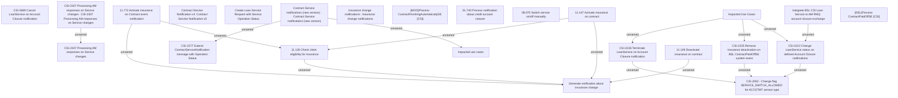

# CBL-18500 (CSI-2052) Change flag SERVICE_SWITCH_ALLOWED for ACCSTMT service type

```mermaid
graph TD
    CSI_2669_Cancel_LoanService_on_Account_Closure_notification["CSI-2669 Cancel LoanService on Account Closure notification"]
    CSI_2307_Processing_AM_responses_on_Service_changes_CSI_2307["CSI-2307 Processing AM responses on Service changes : CSI-2307 Processing AM responses on Service changes"]
    CSI_2307_Processing_AM_responses_on_Service_changes["CSI-2307 Processing AM responses on Service changes"]
    CSI_2277_Extend_ContractServiceNotification_message_with_Ope["CSI-2277 Extend ContractServiceNotification message with Operation Status"]
    Contract_Service_notifications_new_version_Contract_Service_["Contract Service notifications (new version) : Contract Service notifications (new version)"]
    Contract_Service_Notification_v4_Contract_Service_Notificati["Contract Service Notification v4 :Contract Service Notification v5"]
    Create_Loan_Service_Request_with_Service_Operation_Status["Create Loan Service Request with Service Operation Status"]
    Generate_notification_about_insurance_change["Generate notification about insurance change"]
    n_11_772_Activate_insurance_on_Contract_event_notification["11.772 Activate insurance on Contract event notification"]
    n_11_126_Check_client_eligibility_for_insurance["11.126 Check client eligibility for insurance"]
    Insurance_change_notifications_Insurance_change_notification["Insurance change notifications : Insurance change notifications"]
    CSI_2226_Terminate_LoanService_on_Account_Closure_notificati["CSI-2226 Terminate LoanService on Account Closure notification"]
    CSI_2225_Remove_Insurance_deactivation_on_BSL_ContractPaidOf["CSI-2225 Remove Insurance deactivation on BSL ContractPaidOffSE system event"]
    MOD_Process_ContractFinishingAutomaticallySE_CSI["{MOD}Process ContractFinishingAutomaticallySE [CSI]"]
    n_01_740_Process_notification_about_credit_account_closure["01.740 Process notification about credit account closure "]
    n_08_070_Switch_service_on_off_manually["08.070 Switch service on/off manually"]
    CSI_2222_Change_LoanService_status_on_defined_Account_Closur["CSI-2222 Change LoanService status on defined Account Closure notifications"]
    Integrate_BSL_CSI_Loan_Service_to_AM_RMQ_account_closure_exc["Integrate BSL CSI Loan Service to AM RMQ account closure exchange"]
    CSI_2052_Change_flag_SERVICE_SWITCH_ALLOWED_for_ACCSTMT_serv["CSI-2052 - Change flag SERVICE_SWITCH_ALLOWED for ACCSTMT service type"]
    Impacted_Use_Cases["Impacted Use Cases"]
    Impacted_use_cases["Impacted use cases"]
    Impacted_Use_Cases["Impacted Use Cases"]
    n_11_149_Deactivate_insurance_on_contract["11.149 Deactivate insurance on contract"]
    n_11_147_Activate_insurance_on_contract["11.147 Activate insurance on contract"]
    DEL_Process_ContractPaidOffSE_CSI["{DEL}Process ContractPaidOffSE [CSI]"]
    Contract_Service_notifications_new_version_Contract_Service_ -->|unnamed| CSI_2277_Extend_ContractServiceNotification_message_with_Ope
    CSI_2307_Processing_AM_responses_on_Service_changes_CSI_2307 -->|unnamed| CSI_2307_Processing_AM_responses_on_Service_changes
    Contract_Service_notifications_new_version_Contract_Service_ -->|unnamed| Impacted_use_cases
    Impacted_Use_Cases -->|unnamed| CSI_2226_Terminate_LoanService_on_Account_Closure_notificati
    Impacted_Use_Cases -->|unnamed| CSI_2225_Remove_Insurance_deactivation_on_BSL_ContractPaidOf
    Integrate_BSL_CSI_Loan_Service_to_AM_RMQ_account_closure_exc -->|unnamed| CSI_2222_Change_LoanService_status_on_defined_Account_Closur
    Impacted_Use_Cases -->|unnamed| CSI_2222_Change_LoanService_status_on_defined_Account_Closur
    CSI_2226_Terminate_LoanService_on_Account_Closure_notificati -->|unnamed| CSI_2052_Change_flag_SERVICE_SWITCH_ALLOWED_for_ACCSTMT_serv
    CSI_2225_Remove_Insurance_deactivation_on_BSL_ContractPaidOf -->|unnamed| CSI_2052_Change_flag_SERVICE_SWITCH_ALLOWED_for_ACCSTMT_serv
    CSI_2222_Change_LoanService_status_on_defined_Account_Closur -->|unnamed| CSI_2052_Change_flag_SERVICE_SWITCH_ALLOWED_for_ACCSTMT_serv
    n_11_772_Activate_insurance_on_Contract_event_notification -->|unnamed| Generate_notification_about_insurance_change
    n_11_772_Activate_insurance_on_Contract_event_notification -->|unnamed| n_11_126_Check_client_eligibility_for_insurance
    n_11_126_Check_client_eligibility_for_insurance -->|unnamed| Generate_notification_about_insurance_change
    n_11_147_Activate_insurance_on_contract -->|unnamed| n_11_126_Check_client_eligibility_for_insurance
    n_11_147_Activate_insurance_on_contract -->|unnamed| Generate_notification_about_insurance_change
    n_11_149_Deactivate_insurance_on_contract -->|unnamed| Generate_notification_about_insurance_change
```
