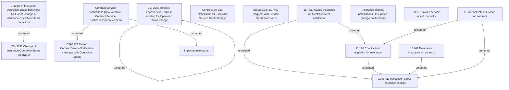

# CBL-18500 (CSI-2052) Removing LoanServiceRequest notification

```mermaid
graph TD
    CSI_2287_Replace_LoanServiceRequest_sending_for_Operation_St["CSI-2287 Replace LoanServiceRequest sending for Operation Status change : CSI-2287 Replace LoanServiceRequest sending for Operation Status change"]
    Change_of_Insurance_Operation_Status_behaviour_CSI_2292_Chan["Change of Insurance Operation Status behaviour :CSI-2292 Change of Insurance Operation Status behaviour"]
    CSI_2292_Change_of_Insurance_Operation_Status_behaviour["CSI-2292 Change of Insurance Operation Status behaviour"]
    CSI_2287_Replace_LoanServiceRequest_sending_for_Operation_St["CSI-2287 Replace LoanServiceRequest sending for Operation Status change"]
    CSI_2277_Extend_ContractServiceNotification_message_with_Ope["CSI-2277 Extend ContractServiceNotification message with Operation Status"]
    Contract_Service_notifications_new_version_Contract_Service_["Contract Service notifications (new version) : Contract Service notifications (new version)"]
    Contract_Service_Notification_v4_Contract_Service_Notificati["Contract Service Notification v4 :Contract Service Notification v5"]
    Create_Loan_Service_Request_with_Service_Operation_Status["Create Loan Service Request with Service Operation Status"]
    Generate_notification_about_insurance_change["Generate notification about insurance change"]
    n_11_772_Activate_insurance_on_Contract_event_notification["11.772 Activate insurance on Contract event notification"]
    n_11_126_Check_client_eligibility_for_insurance["11.126 Check client eligibility for insurance"]
    Insurance_change_notifications_Insurance_change_notification["Insurance change notifications : Insurance change notifications"]
    n_08_070_Switch_service_on_off_manually["08.070 Switch service on/off manually"]
    Impacted_use_cases["Impacted use cases"]
    n_11_149_Deactivate_insurance_on_contract["11.149 Deactivate insurance on contract"]
    n_11_147_Activate_insurance_on_contract["11.147 Activate insurance on contract"]
    Contract_Service_notifications_new_version_Contract_Service_ -->|unnamed| CSI_2277_Extend_ContractServiceNotification_message_with_Ope
    CSI_2287_Replace_LoanServiceRequest_sending_for_Operation_St -->|unnamed| CSI_2287_Replace_LoanServiceRequest_sending_for_Operation_St
    Change_of_Insurance_Operation_Status_behaviour_CSI_2292_Chan -->|unnamed| CSI_2292_Change_of_Insurance_Operation_Status_behaviour
    Contract_Service_notifications_new_version_Contract_Service_ -->|unnamed| Impacted_use_cases
    n_11_772_Activate_insurance_on_Contract_event_notification -->|unnamed| Generate_notification_about_insurance_change
    n_11_772_Activate_insurance_on_Contract_event_notification -->|unnamed| n_11_126_Check_client_eligibility_for_insurance
    n_11_126_Check_client_eligibility_for_insurance -->|unnamed| Generate_notification_about_insurance_change
    n_11_149_Deactivate_insurance_on_contract -->|unnamed| Generate_notification_about_insurance_change
    n_11_147_Activate_insurance_on_contract -->|unnamed| n_11_126_Check_client_eligibility_for_insurance
    n_11_147_Activate_insurance_on_contract -->|unnamed| Generate_notification_about_insurance_change
```
