# CBL-19094 (CSI-2286) EMI Card and Flexi transactions approval

- **Diagram Type**: Custom
- **Package**: HomerSelect/BSL/Requirements Model/Finished/CSI/CBL-19094 (CSI-2286) EMI Card and Flexi transactions approval
- **Diagram ID**: 152117
- **Elements**: 14
- **Connectors**: 8

```mermaid
graph TD
    Use_case_model_Transaction_Supplements_management_services_U["Use case model : Transaction Supplements management services - Use case model"]
    CSI_2553_Cancellation_authorized_transactions_related_to_Tra["CSI-2553 Cancellation authorized transactions related to Transaction Supplement"]
    Use_case_model_Transaction_Supplement_Sales_Quote_adding["Use case model : Transaction Supplement Sales Quote adding"]
    CSI_2513_Storing_CommodityId_to_AccountTransaction["CSI-2513 Storing CommodityId to AccountTransaction"]
    Web_Services_Supplement_definition_Get_Supplement_setting["Web Services : Supplement definition - Get Supplement setting"]
    CSI_2501_Update_Find_Supplement_definition_method["CSI-2501 Update Find Supplement definition method"]
    TransactionSupplements_v2_TransactionSupplements_Reject_Tran["TransactionSupplements_v2 : TransactionSupplements - Reject Transaction Suplement v2"]
    Use_case_model_Transaction_Supplement_rejection_Use_case_mod["Use case model : Transaction Supplement rejection - Use case model"]
    Generated_Messages_Generated_Messages["Generated Messages : Generated Messages"]
    CSI_2511_SIR_Add_the_transaction_approval_request_into_the_p["CSI-2511 SIR - Add the transaction approval request into the process"]
    CSI_2495_Transaction_Supplement_Update_status_to_REJECTED["CSI-2495 Transaction Supplement - Update status to REJECTED"]
    Use_case_model_Transaction_Supplement_authorization_method["Use case model : Transaction Supplement authorization method"]
    Transaction_Supplement_operation_diagram_Transaction_Supplem["Transaction Supplement operation diagram : Transaction Supplement operation diagram"]
    Use_Case_Model_Service_Interpreter_Use_Case_Model["Use Case Model : Service Interpreter - Use Case Model"]
    Use_case_model_Transaction_Supplements_management_services_U -->|unnamed| CSI_2553_Cancellation_authorized_transactions_related_to_Tra
    TransactionSupplements_v2_TransactionSupplements_Reject_Tran -->|unnamed| CSI_2495_Transaction_Supplement_Update_status_to_REJECTED
    Use_case_model_Transaction_Supplement_rejection_Use_case_mod -->|unnamed| CSI_2495_Transaction_Supplement_Update_status_to_REJECTED
    Generated_Messages_Generated_Messages -->|unnamed| CSI_2495_Transaction_Supplement_Update_status_to_REJECTED
    Use_case_model_Transaction_Supplement_authorization_method -->|unnamed| CSI_2511_SIR_Add_the_transaction_approval_request_into_the_p
    Use_Case_Model_Service_Interpreter_Use_Case_Model -->|unnamed| CSI_2511_SIR_Add_the_transaction_approval_request_into_the_p
    Web_Services_Supplement_definition_Get_Supplement_setting -->|unnamed| CSI_2501_Update_Find_Supplement_definition_method
    Use_case_model_Transaction_Supplement_Sales_Quote_adding -->|unnamed| CSI_2513_Storing_CommodityId_to_AccountTransaction
```

