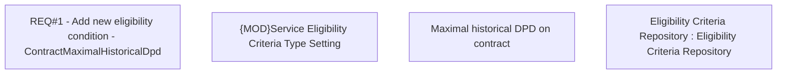

# CBL-19122 (CSI-2230) Add new service eligibility criteria to check the historical DPD

- **Diagram Type**: Custom
- **Package**: HomerSelect/BSL/Requirements Model/Finished/CSI/CBL-19122 (CSI-2230) Add new service eligibility criteria to check the historical DPD
- **Diagram ID**: 149611
- **Elements**: 4
- **Connectors**: 0

