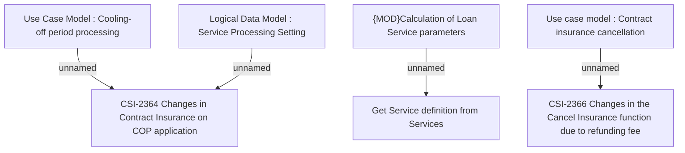

# CBL-19416 (CSI-2295) Cancellation Functionality of Joint Lending VAS

- **Diagram Type**: Custom
- **Package**: HomerSelect/BSL/Requirements Model/Finished/CSI/CBL-19416 (CSI-2295) Cancellation Functionality of Joint Lending VAS
- **Diagram ID**: 150701
- **Elements**: 7
- **Connectors**: 4

