# CBL-19520 (CSI-2290) Apply feature [Replace service] in Bulk assignment for Payment Service

- **Diagram Type**: Custom
- **Package**: HomerSelect/BSL/Requirements Model/Finished/CSI/CBL-19520 (CSI-2290) Apply feature [Replace service] in Bulk assignment for Payment Service
- **Diagram ID**: 151835
- **Elements**: 20
- **Connectors**: 1

```mermaid
graph TD
    CSI_2532_Create_a_new_feature_flag_for_Replace_service_funct["CSI-2532 Create a new feature flag for Replace service functions"]
    CSI_2517_Activate_Insurance_on_the_first_switch_on_confirmat["CSI-2517 Activate Insurance on the first switch on confirmation"]
    el_1754664["Note"]
    CSI_2468_Replace_Insurance_Service_on_Contract_DEV["CSI-2468 Replace Insurance Service on Contract - DEV"]
    CSI_2452_Adding_Service_on_Contract_function_update["CSI-2452 Adding Service on Contract - function update"]
    n_08_294_Process_Account_response_on_Contract_Service_notifi["08.294 Process Account response on Contract Service notifications"]
    CSI_2454_Process_AM_response_on_Contract_Service_notificatio["CSI-2454 Process AM response on Contract Service notifications update"]
    Get_initial_Contract_service_status["Get initial Contract service status"]
    Check_Account_status_by_account_number_from_AM["Check Account status by account number from AM"]
    n_08_080_Add_new_available_Service_on_Contract["08.080 Add new available Service on Contract"]
    Contract_Service_notifications_new_version_Contract_Service_["Contract Service notifications (new version) : Contract Service notifications (new version)"]
    Get_Service_list_of_a_Service_Type["Get Service list of a Service Type"]
    Get_Service_definition_from_Services["Get Service definition from Services"]
    Replace_service["Replace service"]
    n_08_085_Replace_Contract_Service_manually["08.085 Replace Contract Service manually"]
    n_01_782_Replace_Contract_Service["01.782 Replace Contract Service"]
    CSI_2445_Replace_Contract_Service_functions_update["CSI-2445 Replace Contract Service functions update"]
    el_1754668["Boundary"]
    el_1754670["Boundary"]
    el_1754665["Boundary"]
    Contract_Service_notifications_new_version_Contract_Service_ -->|unnamed| CSI_2445_Replace_Contract_Service_functions_update
```

