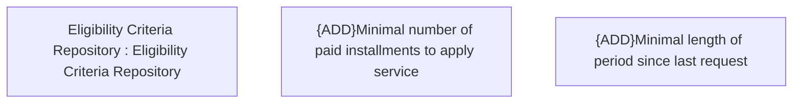

# CBL-19573 (CSI-2894) - New Eligibility container conditions

- **Diagram Type**: Custom
- **Package**: HomerSelect/BSL/Requirements Model/Finished/CSI/CBL-19573 (CSI-2894) - New Eligibility container conditions
- **Diagram ID**: 154532
- **Elements**: 3
- **Connectors**: 0

