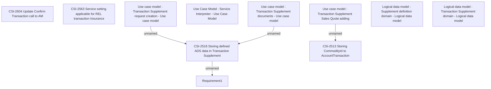

# CBL-19794 (CSI-2470) Additional attributes for Transaction Suplement

```mermaid
graph TD
    CSI_2604_Update_Confirm_Transaction_call_to_AM["CSI-2604 Update Confirm Transaction call to AM"]
    CSI_2563_Service_setting_applicable_for_REL_transaction_Insu["CSI-2563 Service setting applicable for REL transaction Insurance"]
    Use_case_model_Transaction_Supplement_documents_Use_case_mod["Use case model : Transaction Supplement documents - Use case model "]
    Use_Case_Model_Service_Interpreter_Use_Case_Model["Use Case Model : Service Interpreter - Use Case Model"]
    Use_case_model_Transaction_Supplement_request_creation_Use_c["Use case model : Transaction Supplement request creation - Use case model"]
    CSI_2518_Storing_defined_ADS_data_in_Transaction_Supplement["CSI-2518 Storing defined ADS data in Transaction Supplement"]
    Use_case_model_Transaction_Supplement_Sales_Quote_adding["Use case model : Transaction Supplement Sales Quote adding"]
    CSI_2513_Storing_CommodityId_to_AccountTransaction["CSI-2513 Storing CommodityId to AccountTransaction"]
    Logical_data_model_Supplement_definition_domain_Logical_data["Logical data model : Supplement definition domain - Logical data model"]
    Logical_data_model_Transaction_Supplement_domain_Logical_dat["Logical data model : Transaction Supplement domain - Logical data model"]
    Requirement1["Requirement1"]
    Use_case_model_Transaction_Supplement_Sales_Quote_adding -->|unnamed| CSI_2513_Storing_CommodityId_to_AccountTransaction
    CSI_2518_Storing_defined_ADS_data_in_Transaction_Supplement -->|unnamed| Requirement1
    Use_case_model_Transaction_Supplement_request_creation_Use_c -->|unnamed| CSI_2518_Storing_defined_ADS_data_in_Transaction_Supplement
    Use_case_model_Transaction_Supplement_documents_Use_case_mod -->|unnamed| CSI_2518_Storing_defined_ADS_data_in_Transaction_Supplement
```
