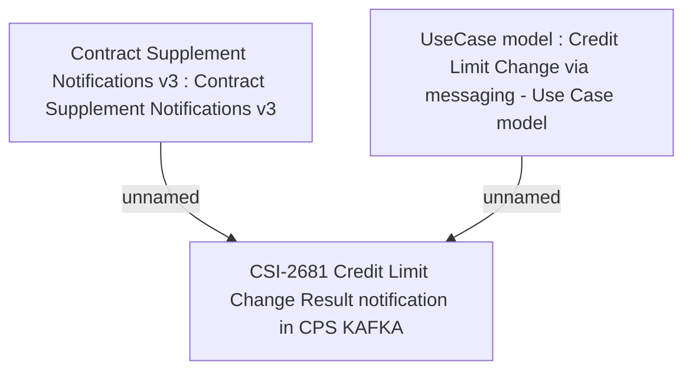

# CBL-20217 (CSI-2597) Vanilla Kafka decommissioning - phase 1

- **Diagram Type**: Custom
- **Package**: HomerSelect/BSL/Requirements Model/Finished/CSI/CBL-20217 (CSI-2597) Vanilla Kafka decommissioning - phase 1
- **Diagram ID**: 152965
- **Elements**: 3
- **Connectors**: 2

