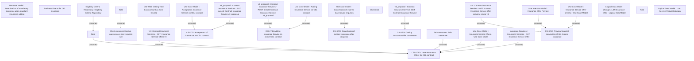

# CBL-20284 (CSI-2701) Add Insurance To CEL Contracts

```mermaid
graph TD
    Use_case_model_Deactivation_of_mandatory_insurance_upon_stan["Use case model : Deactivation of mandatory insurance upon standard insurance adding"]
    Business_Events_for_CEL_insurance["Business Events for CEL insurance"]
    v3_Contract_Insurance_Services_GET_Insurance_Service_Offers_["v3 : Contract Insurance Services - GET: Insurance Service Offers v3"]
    v3_proposal_Contract_Insurance_Service_GET_Contract_Insuranc["v3_proposal : Contract Insurance Service: GET Contract Insurance Service"]
    v3_Contract_Insurance_Services_GET_Contract_Insurance_Servic["v3 : Contract Insurance Services - GET: Contract Insurance Service offer preview create v3"]
    CSI_2765_Getting_Total_Loan_amount_as_Sum_Insured["CSI-2765 Getting Total Loan amount as Sum Insured"]
    Check_concurrent_active_loan_services_and_requests_rule["Check concurrent active loan services and requests rule"]
    el_1876448["Note"]
    Use_Case_Model_Acceptation_Insurance_Service_on_CEL_contract["Use Case Model : Acceptation Insurance Service on CEL contract"]
    v3_proposal_Contract_Insurance_Services_POST_Create_Contract["v3_proposal : Contract Insurance Services - POST: Create Contract Insurance Service v3_proposal"]
    v3_proposal_Contract_Insurance_Services_PUT_Accept_Contract_["v3_proposal : Contract Insurance Services - PUT: Accept Contract Insurance Service v3_proposal"]
    Eligibility_Criteria_Repository_Eligibility_Criteria_Reposit["Eligibility Criteria Repository : Eligibility Criteria Repository"]
    el_1876462["Note"]
    CSI_2752_Acceptation_of_Insurance_for_CEL_contract["CSI-2752 Acceptation of Insurance for CEL contract"]
    Checklist1["Checklist1"]
    Use_Case_Model_Adding_Insurance_Service_on_CEL_contract["Use Case Model : Adding Insurance Service on CEL contract"]
    CSI_2746_Adding_Insurance_Service_on_active_CEL_contract["CSI-2746 Adding Insurance Service on active CEL contract"]
    Use_case_model_Cancellation_of_expired_loan_service_requests["Use case model : Cancellation of expired loan service requests"]
    CSI_2753_Cancellation_of_expired_Insurance_offer_requests["CSI-2753 Cancellation of expired Insurance offer requests"]
    CSI_2738_Getting_Insurance_offer_parameters["CSI-2738 Getting Insurance offer parameters"]
    User_Interface_Model_Insurance_Offer_Preview["User Interface Model : Insurance Offer Preview"]
    Use_Case_Model_Insurance_Service_Offer_preview_Use_Case_Mode["Use Case Model : Insurance Service Offer preview - Use Case Model"]
    Logical_Data_Model_changes_LSR_Insurance_Offer_Logical_Data_["Logical Data Model changes :LSR.Insurance Offer - Logical Data Model"]
    el_1876451["Note"]
    Use_Case_Model_Insurance_Service_Offers_Use_Case_Model["Use Case Model : Insurance Service Offers - Use Case Model"]
    Insurance_Services_Insurance_Services_GET_Insurance_Service_["Insurance Services : Insurance Services - GET: Insurance Service Offer"]
    Tab_Insurance_Tab_Insurance["Tab-Insurance : Tab-Insurance"]
    CSI_2721_Preview_financial_parameters_of_the_chosen_Insuranc["CSI-2721 Preview financial parameters of the chosen Insurance"]
    CSI_2720_Create_Insurance_Offers_for_CEL_contract["CSI-2720 Create Insurance Offers for CEL contract"]
    Logical_Data_Model_Loan_Service_Request_domain["Logical Data Model : Loan Service Request domain"]
    el_1876462 -->|unnamed| CSI_2720_Create_Insurance_Offers_for_CEL_contract
    v3_proposal_Contract_Insurance_Service_GET_Contract_Insuranc -->|unnamed| CSI_2738_Getting_Insurance_offer_parameters
    v3_Contract_Insurance_Services_GET_Contract_Insurance_Servic -->|unnamed| CSI_2721_Preview_financial_parameters_of_the_chosen_Insuranc
    el_1876448 -->|unnamed| Check_concurrent_active_loan_services_and_requests_rule
    Use_Case_Model_Acceptation_Insurance_Service_on_CEL_contract -->|unnamed| CSI_2752_Acceptation_of_Insurance_for_CEL_contract
    v3_proposal_Contract_Insurance_Services_POST_Create_Contract -->|unnamed| CSI_2746_Adding_Insurance_Service_on_active_CEL_contract
    v3_Contract_Insurance_Services_GET_Insurance_Service_Offers_ -->|unnamed| CSI_2720_Create_Insurance_Offers_for_CEL_contract
    Eligibility_Criteria_Repository_Eligibility_Criteria_Reposit -->|unnamed| el_1876462
    Tab_Insurance_Tab_Insurance -->|unnamed| CSI_2720_Create_Insurance_Offers_for_CEL_contract
    Use_Case_Model_Adding_Insurance_Service_on_CEL_contract -->|unnamed| CSI_2746_Adding_Insurance_Service_on_active_CEL_contract
    Use_case_model_Cancellation_of_expired_loan_service_requests -->|unnamed| CSI_2753_Cancellation_of_expired_Insurance_offer_requests
    User_Interface_Model_Insurance_Offer_Preview -->|unnamed| CSI_2721_Preview_financial_parameters_of_the_chosen_Insuranc
    Use_Case_Model_Insurance_Service_Offer_preview_Use_Case_Mode -->|unnamed| CSI_2721_Preview_financial_parameters_of_the_chosen_Insuranc
    Use_Case_Model_Insurance_Service_Offers_Use_Case_Model -->|unnamed| CSI_2720_Create_Insurance_Offers_for_CEL_contract
    Insurance_Services_Insurance_Services_GET_Insurance_Service_ -->|unnamed| CSI_2720_Create_Insurance_Offers_for_CEL_contract
    v3_proposal_Contract_Insurance_Services_PUT_Accept_Contract_ -->|unnamed| CSI_2752_Acceptation_of_Insurance_for_CEL_contract
```
