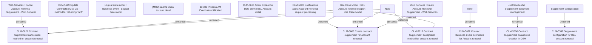

# CBL-20608 (CLM-5431) Expiration of Virtual Limit Contracts

```mermaid
graph TD
    Web_Services_Cancel_Account_Renewal_Supplement_Web_Services["Web Services : Cancel Account Renewal Supplement - Web Services"]
    CLM_5699_Update_ContractService_GET_method_for_returning_Tar["CLM-5699 Update ContractService GET method for returning Tariff"]
    Logical_data_model_Business_event_Logical_data_model["Logical data model : Business event - Logical data model"]
    MOD_12_601_Show_account_detail["{MOD}12.601 Show account detail"]
    n_13_300_Process_AM_EventInfo_notification["13.300 Process AM EventInfo notification"]
    CLM_5624_Show_Expiration_Date_on_the_BSL_Account_detail["CLM-5624 Show Expiration Date on the BSL Account detail"]
    CLM_5620_Notifications_about_Account_Renewal_request_process["CLM-5620 Notifications about Account Renewal request processing"]
    Use_Case_Model_REL_Account_renewal_support_Use_Case_Model["Use Case Model : REL Account renewal support - Use Case Model"]
    Web_Services_Create_Account_Renewal_Supplement_Web_Services["Web Services :Create Account Renewal Supplement - Web Services"]
    CLM_5622_Contract_Business_Event_definitions_for_Account_ren["CLM-5622 Contract Business Event definitions for Account renewal"]
    el_1880057["Note"]
    UseCase_Model_Supplement_document_management["UseCase Model : Supplement document management"]
    CLM_5618_Contract_Supplement_acceptation_method_for_account_["CLM-5618 Contract Supplement acceptation method for account renewal"]
    CLM_5621_Contract_Supplement_cancelation_method_for_account_["CLM-5621 Contract Supplement cancelation method for account renewal"]
    el_1880058["Note"]
    Supplement_configuration["Supplement configuration"]
    CLM_5600_Contract_Supplement_datasource_creation_in_DSM["CLM-5600 Contract Supplement datasource creation in DSM"]
    CLM_5608_Create_contract_supplement_for_account_renewal["CLM-5608 Create contract supplement for account renewal"]
    CLM_5599_Supplement_configuration_for_REL_account_renewal["CLM-5599 Supplement configuration for REL account renewal"]
    Supplement_configuration -->|unnamed| CLM_5599_Supplement_configuration_for_REL_account_renewal
    Use_Case_Model_REL_Account_renewal_support_Use_Case_Model -->|unnamed| CLM_5608_Create_contract_supplement_for_account_renewal
    el_1880058 -->|unnamed| CLM_5608_Create_contract_supplement_for_account_renewal
    Web_Services_Create_Account_Renewal_Supplement_Web_Services -->|unnamed| CLM_5608_Create_contract_supplement_for_account_renewal
    UseCase_Model_Supplement_document_management -->|unnamed| CLM_5600_Contract_Supplement_datasource_creation_in_DSM
    Web_Services_Cancel_Account_Renewal_Supplement_Web_Services -->|unnamed| CLM_5621_Contract_Supplement_cancelation_method_for_account_
    Use_Case_Model_REL_Account_renewal_support_Use_Case_Model -->|unnamed| CLM_5621_Contract_Supplement_cancelation_method_for_account_
    el_1880058 -->|unnamed| CLM_5621_Contract_Supplement_cancelation_method_for_account_
    el_1880058 -->|unnamed| CLM_5618_Contract_Supplement_acceptation_method_for_account_
    Use_Case_Model_REL_Account_renewal_support_Use_Case_Model -->|unnamed| CLM_5618_Contract_Supplement_acceptation_method_for_account_
    el_1880057 -->|unnamed| CLM_5622_Contract_Business_Event_definitions_for_Account_ren
```
