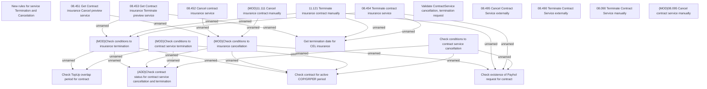

# CBL-20860 (CSI-2911) New rules for service Termination and Cancelation

```mermaid
graph TD
    New_rules_for_service_Termination_and_Cancelation["New rules for service Termination and Cancelation"]
    Check_TopUp_overlap_period_for_contract["Check TopUp overlap period for contract"]
    MOD_Check_conditions_to_contract_service_termination["{MOD}Check conditions to contract service termination"]
    Check_conditions_to_contract_service_cancellation["Check conditions to contract service cancellation"]
    Check_existence_of_Payhol_request_for_contract["Check existence of Payhol request for contract"]
    Check_contract_for_active_COP_GRPER_period["Check contract for active COP/GRPER period"]
    ADD_Check_contract_status_for_contract_service_cancellation_["{ADD}Check contract status for contract service cancellation and termination"]
    n_08_452_Cancel_contract_insurance_service["08.452 Cancel contract insurance service"]
    n_08_451_Get_Contract_insurance_Cancel_preview_service["08.451 Get Contract insurance Cancel preview service"]
    MOD_11_111_Cancel_insurance_contract_manually["{MOD}11.111 Cancel insurance contract manually"]
    n_08_453_Get_Contract_insurance_Terminate_preview_service["08.453 Get Contract insurance Terminate preview service"]
    n_08_454_Terminate_contract_insurance_service["08.454 Terminate contract insurance service"]
    n_11_121_Terminate_insurance_contract_manually["11.121 Terminate insurance contract manually"]
    Validate_ContractService_cancellation_termination_request["Validate ContractService cancellation, termination request"]
    n_08_495_Cancel_Contract_Service_externally["08.495 Cancel Contract Service externally"]
    n_08_490_Terminate_Contract_Service_externally["08.490 Terminate Contract Service externally"]
    n_08_090_Terminate_Contract_Service_manually["08.090 Terminate Contract Service manually"]
    MOD_08_095_Cancel_contract_service_manually["{MOD}08.095 Cancel contract service manually"]
    MOD_Check_conditions_to_insurance_cancellation["{MOD}Check conditions to insurance cancellation"]
    Get_termination_date_for_CEL_insurance["Get termination date for CEL insurance"]
    MOD_Check_conditions_to_insurance_termination["{MOD}Check conditions to insurance termination"]
    MOD_Check_conditions_to_insurance_cancellation -->|unnamed| Check_existence_of_Payhol_request_for_contract
    MOD_Check_conditions_to_insurance_termination -->|unnamed| ADD_Check_contract_status_for_contract_service_cancellation_
    MOD_Check_conditions_to_insurance_termination -->|unnamed| Check_contract_for_active_COP_GRPER_period
    MOD_Check_conditions_to_insurance_termination -->|unnamed| Check_TopUp_overlap_period_for_contract
    MOD_Check_conditions_to_insurance_cancellation -->|unnamed| Check_contract_for_active_COP_GRPER_period
    MOD_Check_conditions_to_insurance_cancellation -->|unnamed| ADD_Check_contract_status_for_contract_service_cancellation_
    n_08_451_Get_Contract_insurance_Cancel_preview_service -->|unnamed| MOD_Check_conditions_to_insurance_cancellation
    n_08_452_Cancel_contract_insurance_service -->|unnamed| MOD_Check_conditions_to_insurance_cancellation
    n_08_453_Get_Contract_insurance_Terminate_preview_service -->|unnamed| MOD_Check_conditions_to_insurance_termination
    n_08_453_Get_Contract_insurance_Terminate_preview_service -->|unnamed| Get_termination_date_for_CEL_insurance
    n_11_121_Terminate_insurance_contract_manually -->|unnamed| Check_existence_of_Payhol_request_for_contract
    n_11_121_Terminate_insurance_contract_manually -->|unnamed| Get_termination_date_for_CEL_insurance
    n_11_121_Terminate_insurance_contract_manually -->|unnamed| MOD_Check_conditions_to_insurance_termination
    n_08_454_Terminate_contract_insurance_service -->|unnamed| MOD_Check_conditions_to_insurance_termination
    n_08_454_Terminate_contract_insurance_service -->|unnamed| Get_termination_date_for_CEL_insurance
    n_08_454_Terminate_contract_insurance_service -->|unnamed| Check_existence_of_Payhol_request_for_contract
    MOD_11_111_Cancel_insurance_contract_manually -->|unnamed| MOD_Check_conditions_to_insurance_cancellation
    MOD_Check_conditions_to_contract_service_termination -->|unnamed| Check_contract_for_active_COP_GRPER_period
    MOD_Check_conditions_to_contract_service_termination -->|unnamed| Check_TopUp_overlap_period_for_contract
    MOD_Check_conditions_to_contract_service_termination -->|unnamed| ADD_Check_contract_status_for_contract_service_cancellation_
    Check_conditions_to_contract_service_cancellation -->|unnamed| Check_contract_for_active_COP_GRPER_period
    Check_conditions_to_contract_service_cancellation -->|unnamed| Check_existence_of_Payhol_request_for_contract
    Check_conditions_to_contract_service_cancellation -->|unnamed| ADD_Check_contract_status_for_contract_service_cancellation_
```
