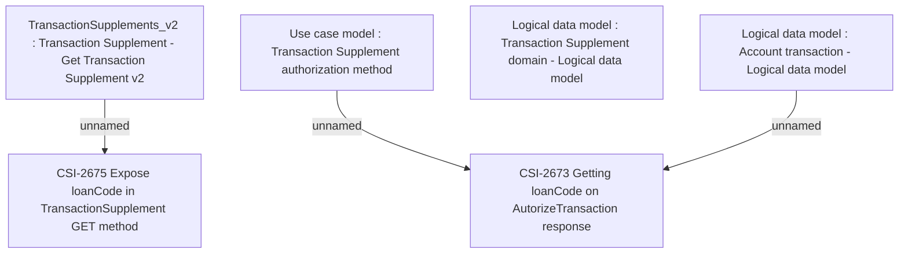

# CBL-21486 (CSI-2666) Expose loan code for Authorized Transactions in API

- **Diagram Type**: Custom
- **Package**: HomerSelect/BSL/Requirements Model/Finished/CSI/CBL-21486 (CSI-2666) Expose loan code for Authorized Transactions in API
- **Diagram ID**: 152966
- **Elements**: 6
- **Connectors**: 3

