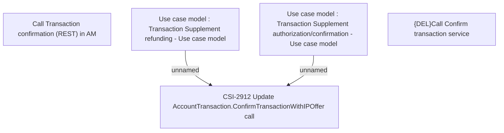

# CBL-21490 (CSI-2856) Solution to add BNPL New Partners without Config CBL

```mermaid
graph TD
    Call_Transaction_confirmation_REST_in_AM["Call Transaction confirmation (REST) in AM"]
    Use_case_model_Transaction_Supplement_refunding_Use_case_mod["Use case model : Transaction Supplement refunding - Use case model"]
    Use_case_model_Transaction_Supplement_authorization_confirma["Use case model : Transaction Supplement authorization/confirmation - Use case model"]
    DEL_Call_Confirm_transaction_service["{DEL}Call Confirm transaction service"]
    CSI_2912_Update_AccountTransaction_ConfirmTransactionWithIPO["CSI-2912 Update AccountTransaction.ConfirmTransactionWithIPOffer call"]
    Use_case_model_Transaction_Supplement_refunding_Use_case_mod -->|unnamed| CSI_2912_Update_AccountTransaction_ConfirmTransactionWithIPO
    Use_case_model_Transaction_Supplement_authorization_confirma -->|unnamed| CSI_2912_Update_AccountTransaction_ConfirmTransactionWithIPO
```
