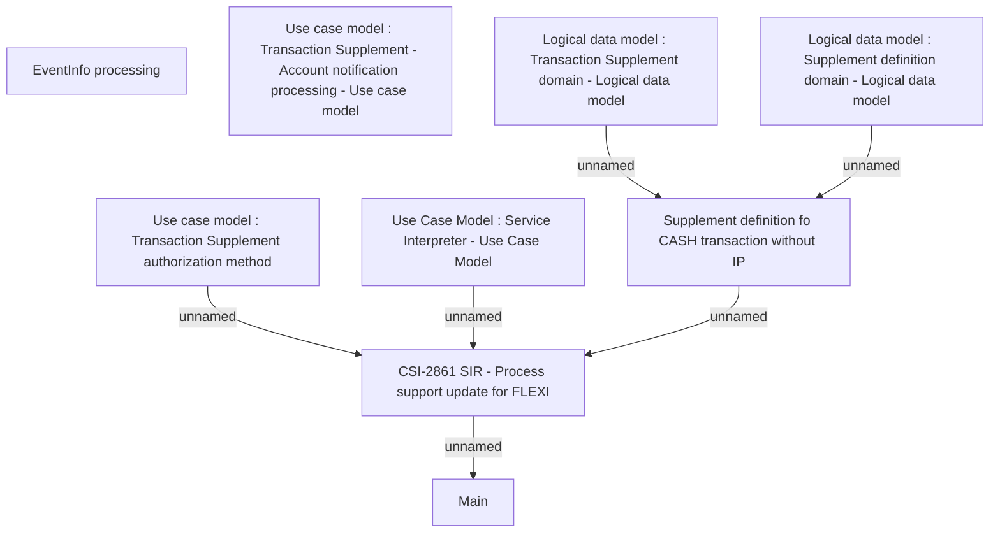

# CBL-21862 (CSI-2731) Transaction routing through Blaze to get final Approve

```mermaid
graph TD
    EventInfo_processing["EventInfo processing"]
    Use_case_model_Transaction_Supplement_Account_notification_p["Use case model : Transaction Supplement - Account notification processing - Use case model"]
    Use_case_model_Transaction_Supplement_authorization_method["Use case model : Transaction Supplement authorization method"]
    Logical_data_model_Transaction_Supplement_domain_Logical_dat["Logical data model : Transaction Supplement domain - Logical data model"]
    Logical_data_model_Supplement_definition_domain_Logical_data["Logical data model : Supplement definition domain - Logical data model"]
    Use_Case_Model_Service_Interpreter_Use_Case_Model["Use Case Model : Service Interpreter - Use Case Model"]
    CSI_2861_SIR_Process_support_update_for_FLEXI["CSI-2861 SIR - Process support update for FLEXI"]
    Supplement_definition_fo_CASH_transaction_without_IP["Supplement definition fo CASH transaction without IP"]
    Main["Main"]
    CSI_2861_SIR_Process_support_update_for_FLEXI -->|unnamed| Main
    Logical_data_model_Transaction_Supplement_domain_Logical_dat -->|unnamed| Supplement_definition_fo_CASH_transaction_without_IP
    Logical_data_model_Supplement_definition_domain_Logical_data -->|unnamed| Supplement_definition_fo_CASH_transaction_without_IP
    Use_case_model_Transaction_Supplement_authorization_method -->|unnamed| CSI_2861_SIR_Process_support_update_for_FLEXI
    Use_Case_Model_Service_Interpreter_Use_Case_Model -->|unnamed| CSI_2861_SIR_Process_support_update_for_FLEXI
    Supplement_definition_fo_CASH_transaction_without_IP -->|unnamed| CSI_2861_SIR_Process_support_update_for_FLEXI
```
