# CBL-22680 Overview of Stories

- **Diagram Type**: Custom
- **Package**: HomerSelect/BSL/Requirements Model/Finished/CSI/CBL-22680 Service Management Modules for REL (KZ)
- **Diagram ID**: 158326
- **Elements**: 23
- **Connectors**: 15

```mermaid
graph TD
    CSI_3088_VAS_Deal_Insurance_Prolongation_notification["CSI-3088 VAS - Deal (Insurance) Prolongation notification"]
    CSI_3061_VAS_Cancel_Deal_method_update_cancel_out_payment["CSI-3061 VAS - Cancel Deal method update - cancel out payment"]
    CSI_2970_Add_Service_to_Contract_CSI_2970_Add_Service_to_Con["CSI-2970 Add Service to Contract : CSI-2970 Add Service to Contract"]
    Get_Contract_Service_methods["Get Contract Service methods"]
    CSI_1660_Period_methods_implementation["CSI-1660 Period methods implementation"]
    CSI_1454_Create_Deal_method_implementation["CSI-1454 Create Deal method implementation"]
    CSI_2969_Cancel_Deal_method["CSI-2969 Cancel Deal method"]
    CSI_2968_Terminate_Deal_method["CSI-2968 Terminate Deal method"]
    CSI_2936_VAS_Deal_deactivation_method["CSI-2936 VAS Deal deactivation method"]
    CSI_2918_VAS_Deal_activation_method["CSI-2918 VAS Deal activation method"]
    CSI_2967_Prolong_Deal_Period_method["CSI-2967 Prolong Deal Period method"]
    CSI_2979_Process_Account_EoM_billing_notification["CSI-2979 Process Account EoM billing notification"]
    CSI_2977_Process_Contract_notifications["CSI-2977 Process Contract notifications"]
    CSI_2976_Process_Contract_Service_operation_response["CSI-2976 Process Contract Service operation response"]
    CSI_2978_Process_Account_Closure_notification["CSI-2978 Process Account Closure notification"]
    CSI_2974_Terminate_Service_on_Contract["CSI-2974 Terminate Service on Contract"]
    CSI_2975_Cancel_Service_on_Contract["CSI-2975 Cancel Service on Contract"]
    CSI_2972_Deactivate_Service_on_Contract["CSI-2972 Deactivate Service on Contract"]
    CSI_2973_Replace_Service_on_Contract["CSI-2973 Replace Service on Contract"]
    CSI_2971_Activate_Service_on_Contract["CSI-2971 Activate Service on Contract"]
    CSI_2970_Add_Service_to_Contract["CSI-2970 Add Service to Contract"]
    COS["COS"]
    VAS["VAS"]
    CSI_2970_Add_Service_to_Contract_CSI_2970_Add_Service_to_Con -->|unnamed| CSI_2970_Add_Service_to_Contract
    CSI_2979_Process_Account_EoM_billing_notification -->|unnamed| CSI_2971_Activate_Service_on_Contract
    CSI_2977_Process_Contract_notifications -->|unnamed| CSI_2971_Activate_Service_on_Contract
    CSI_2970_Add_Service_to_Contract -->|unnamed| CSI_2971_Activate_Service_on_Contract
    CSI_2979_Process_Account_EoM_billing_notification -->|unnamed| CSI_2972_Deactivate_Service_on_Contract
    CSI_2978_Process_Account_Closure_notification -->|unnamed| CSI_2972_Deactivate_Service_on_Contract
    CSI_2978_Process_Account_Closure_notification -->|unnamed| CSI_2975_Cancel_Service_on_Contract
    CSI_2979_Process_Account_EoM_billing_notification -->|unnamed| CSI_2974_Terminate_Service_on_Contract
    CSI_2978_Process_Account_Closure_notification -->|unnamed| CSI_2974_Terminate_Service_on_Contract
    CSI_2979_Process_Account_EoM_billing_notification -->|unnamed| CSI_2967_Prolong_Deal_Period_method
    CSI_2971_Activate_Service_on_Contract -->|unnamed| CSI_2918_VAS_Deal_activation_method
    CSI_2972_Deactivate_Service_on_Contract -->|unnamed| CSI_2936_VAS_Deal_deactivation_method
    CSI_2974_Terminate_Service_on_Contract -->|unnamed| CSI_2968_Terminate_Deal_method
    CSI_2975_Cancel_Service_on_Contract -->|unnamed| CSI_2969_Cancel_Deal_method
    CSI_2970_Add_Service_to_Contract -->|unnamed| CSI_1454_Create_Deal_method_implementation
```

