# CBL-22680 Service Management Modules for REL (KZ)

- **Diagram Type**: Custom
- **Package**: HomerSelect/BSL/Requirements Model/Finished/CSI/CBL-22680 Service Management Modules for REL (KZ)
- **Diagram ID**: 158325
- **Elements**: 15
- **Connectors**: 1

```mermaid
graph TD
    Affected_use_cases_in_KZ_BSL["Affected use cases in KZ BSL"]
    Needs_of_KZ_BSL_for_integration["Needs of KZ BSL for integration"]
    Requirements_CBL_11727_CSI_376_CSI_Modularization_Insurance_["Requirements: CBL-11727 (CSI-376) CSI Modularization - Insurance Contract"]
    Contract_Services_COS_Contract_Services_COS_overview["Contract Services (COS) : Contract Services (COS) overview"]
    Expected_impact_on_KZ_BSL["Expected impact on KZ BSL"]
    New_Service_management_module_introduction_for_KZ_BSL["New Service management module introduction for KZ BSL"]
    Contract_Insurance_Service_activation["Contract Insurance Service activation"]
    Prolong_Insurance_Service_on_Contract_Prolong_Insurance_Serv["Prolong Insurance Service on Contract : Prolong Insurance Service on Contract"]
    Add_Insurance_service_to_Contract_Contract_Service_integrati["Add Insurance service to Contract - Contract Service integration : Add Insurance service to Contract - Contract Service integration"]
    Activate_Insurance_service_on_Contract_Contract_Service_inte["Activate Insurance service on Contract - Contract Service integration : Activate Insurance service on Contract - Contract Service integration"]
    CBL_11727_CSI_376_CSI_Modularization_Insurance_Contract_Requ["CBL-11727 (CSI-376) CSI Modularization - Insurance Contract : Requirements: CBL-11727 (CSI-376) CSI Modularization - Insurance Contract"]
    Use_Case_Model_Use_Case_Model["Use Case Model : Use Case Model"]
    VAS_Deal_module["VAS Deal module"]
    Contract_Service_module_estimations["Contract Service module estimations"]
    KZ["KZ"]
    Use_Case_Model_Use_Case_Model -->|unnamed| VAS_Deal_module
```

