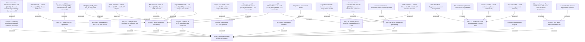

# CBL-244 (CLM-971) Cash on card with separate limit (ALOP)

```mermaid
graph TD
    REQ_10_Modification_of_the_ALOP_data_source["REQ #10 - Modification of the ALOP data source"]
    Use_case_model_Advanced_Cash_on_Loan_ALOP_Account_notificati["Use case model : Advanced Cash on Loan (ALOP) - Account notification processing - Use case model"]
    REQ_9_Receiving_Account_Management_EventInfo_messages["REQ #9 - Receiving Account Management EventInfo messages"]
    Web_Services_Loan_on_Phone_ALOP_Get_ALOP_requests_by_CUID["Web Services : Loan on Phone (ALOP) - Get ALOP requests by CUID"]
    REQ_8_Getting_ALOP_Contract_Supplement_list_of_Client["REQ #8 - Getting ALOP Contract Supplement list of Client"]
    REQ_7_Changes_in_the_current_ALOP_functions_and_APIs["REQ #7 - Changes in the current ALOP functions and APIs"]
    Use_case_model_Advanced_Cash_on_Card_ALOP_transaction_author["Use case model : Advanced Cash on Card (ALOP) transaction authorization - Use case model"]
    Use_case_model_Advanced_Cash_on_Card_ALOP_documents_Use_case["Use case model : Advanced Cash on Card (ALOP) documents - Use case model "]
    Account_Transactions_AuthorizeTransactionWithIPVariant["Account Transactions : AuthorizeTransactionWithIPVariant"]
    UseCase_Model_Supplement_document_management["UseCase Model : Supplement document management"]
    ADD_HO_ALOP_DATA_HO_ALOP_DATA["{ADD}HO_ALOP_DATA : HO_ALOP_DATA"]
    Use_case_model_Advanced_Cash_on_Card_ALOP_management_Use_cas["Use case model : Advanced Cash on Card (ALOP) management - Use case model"]
    Web_Services_Loan_on_Phone_ALOP_Cancel_ALOP_Request["Web Services : Loan on Phone (ALOP) - Cancel ALOP Request"]
    Web_Services_Loan_on_Phone_ALOP_Get_ALOP_request["Web Services : Loan on Phone (ALOP) - Get ALOP request"]
    Use_Case_Model_Contract_supplement_approval["Use Case Model : Contract supplement approval"]
    Advanced_Loan_on_Phone_Notifications_Advanced_Loan_on_Phone_["Advanced Loan on Phone Notifications : Advanced Loan on Phone Notifications"]
    REQ_6_ALOP_transaction_processing["REQ #6 - ALOP transaction processing"]
    Logical_data_model_Loan_on_card_ALOP_processing_Logical_data["Logical data model : Loan on card (ALOP) processing - Logical data model"]
    Web_Services_Loan_on_Phone_ALOP_Create_ALOP_cash["Web Services :Loan on Phone (ALOP) - Create ALOP cash"]
    Logical_data_model_Account_transaction_Logical_data_model["Logical data model : Account transaction - Logical data model"]
    Logical_data_model_Loan_on_card_ALOP_processing_Logical_data["Logical data model : Loan on card (ALOP) processing - Logical data model"]
    REQ_5_ALOP_documents_processing["REQ #5 - ALOP documents processing"]
    UseCase_Model_Cancel_contract_supplement_manually["UseCase Model : Cancel contract supplement manually"]
    UseCase_Model_Cancel_contract_supplement_automatically["UseCase Model : Cancel contract supplement automatically"]
    Tab_Contract_supplements_Tab_Contract_supplements["Tab-Contract supplements : Tab-Contract supplements"]
    Use_case_model_Advanced_Cash_on_Card_ALOP_request_creation_U["Use case model :Advanced Cash on Card (ALOP) request creation - Use case model"]
    Logical_data_model_Loan_on_card_ALOP_definition_Logical_data["Logical data model :Loan on card (ALOP) definition - Logical data model"]
    REQ_4_Approval_of_ALOP_evaluation_and_Cancellation["REQ #4 - Approval of ALOP evaluation and Cancellation"]
    REQ_1_Definition_of_ALOP_supplement["REQ #1 - Definition of ALOP supplement
"]
    REQ_3_LAP_vector_preparation_for_ALOP["REQ #3 - LAP vector preparation for ALOP"]
    REQ_ALOP_transaction_management_in_Contract_detail["REQ # - ALOP transaction management in Contract detail"]
    REQ_INT_Integration_overview["REQ #INT - Integration overview"]
    Cash_on_card_operation_diagram["Cash on card operation diagram"]
    Integration_Component_model["Integration - Component model"]
    REQ_2_Creating_ALOP_supplement["REQ #2 - Creating ALOP supplement"]
    ALOP_Process_description_of_CLM_part_support["ALOP Process description of CLM part support"]
    ADD_HO_ALOP_DATA_HO_ALOP_DATA -->|unnamed| REQ_5_ALOP_documents_processing
    Advanced_Loan_on_Phone_Notifications_Advanced_Loan_on_Phone_ -->|unnamed| REQ_3_LAP_vector_preparation_for_ALOP
    Use_Case_Model_Contract_supplement_approval -->|unnamed| REQ_3_LAP_vector_preparation_for_ALOP
    Logical_data_model_Loan_on_card_ALOP_definition_Logical_data -->|unnamed| REQ_1_Definition_of_ALOP_supplement
    Web_Services_Loan_on_Phone_ALOP_Get_ALOP_request -->|unnamed| REQ_4_Approval_of_ALOP_evaluation_and_Cancellation
    Web_Services_Loan_on_Phone_ALOP_Cancel_ALOP_Request -->|unnamed| REQ_4_Approval_of_ALOP_evaluation_and_Cancellation
    Use_case_model_Advanced_Cash_on_Card_ALOP_management_Use_cas -->|unnamed| REQ_4_Approval_of_ALOP_evaluation_and_Cancellation
    ADD_HO_ALOP_DATA_HO_ALOP_DATA -->|unnamed| REQ_10_Modification_of_the_ALOP_data_source
    Use_case_model_Advanced_Cash_on_Card_ALOP_documents_Use_case -->|unnamed| REQ_5_ALOP_documents_processing
    UseCase_Model_Supplement_document_management -->|unnamed| REQ_ALOP_transaction_management_in_Contract_detail
    Logical_data_model_Account_transaction_Logical_data_model -->|unnamed| REQ_6_ALOP_transaction_processing
    Use_case_model_Advanced_Cash_on_Card_ALOP_transaction_author -->|unnamed| REQ_6_ALOP_transaction_processing
    Account_Transactions_AuthorizeTransactionWithIPVariant -->|unnamed| REQ_6_ALOP_transaction_processing
    Use_case_model_Advanced_Cash_on_Card_ALOP_management_Use_cas -->|unnamed| REQ_8_Getting_ALOP_Contract_Supplement_list_of_Client
    Web_Services_Loan_on_Phone_ALOP_Get_ALOP_requests_by_CUID -->|unnamed| REQ_8_Getting_ALOP_Contract_Supplement_list_of_Client
    Use_case_model_Advanced_Cash_on_Loan_ALOP_Account_notificati -->|unnamed| REQ_9_Receiving_Account_Management_EventInfo_messages
    Logical_data_model_Loan_on_card_ALOP_processing_Logical_data -->|unnamed| REQ_5_ALOP_documents_processing
    REQ_9_Receiving_Account_Management_EventInfo_messages -->|unnamed| ALOP_Process_description_of_CLM_part_support
    REQ_2_Creating_ALOP_supplement -->|unnamed| ALOP_Process_description_of_CLM_part_support
    REQ_4_Approval_of_ALOP_evaluation_and_Cancellation -->|unnamed| ALOP_Process_description_of_CLM_part_support
    REQ_1_Definition_of_ALOP_supplement -->|unnamed| ALOP_Process_description_of_CLM_part_support
    REQ_5_ALOP_documents_processing -->|unnamed| ALOP_Process_description_of_CLM_part_support
    REQ_INT_Integration_overview -->|unnamed| ALOP_Process_description_of_CLM_part_support
    REQ_6_ALOP_transaction_processing -->|unnamed| ALOP_Process_description_of_CLM_part_support
    Tab_Contract_supplements_Tab_Contract_supplements -->|unnamed| REQ_ALOP_transaction_management_in_Contract_detail
    REQ_8_Getting_ALOP_Contract_Supplement_list_of_Client -->|unnamed| ALOP_Process_description_of_CLM_part_support
    UseCase_Model_Cancel_contract_supplement_automatically -->|unnamed| REQ_ALOP_transaction_management_in_Contract_detail
    REQ_3_LAP_vector_preparation_for_ALOP -->|unnamed| ALOP_Process_description_of_CLM_part_support
    Web_Services_Loan_on_Phone_ALOP_Create_ALOP_cash -->|unnamed| REQ_2_Creating_ALOP_supplement
    Use_case_model_Advanced_Cash_on_Card_ALOP_request_creation_U -->|unnamed| REQ_2_Creating_ALOP_supplement
    Logical_data_model_Loan_on_card_ALOP_processing_Logical_data -->|unnamed| REQ_2_Creating_ALOP_supplement
    Integration_Component_model -->|unnamed| REQ_INT_Integration_overview
    UseCase_Model_Cancel_contract_supplement_manually -->|unnamed| REQ_ALOP_transaction_management_in_Contract_detail
    Cash_on_card_operation_diagram -->|unnamed| ALOP_Process_description_of_CLM_part_support
    REQ_7_Changes_in_the_current_ALOP_functions_and_APIs -->|unnamed| ALOP_Process_description_of_CLM_part_support
```
