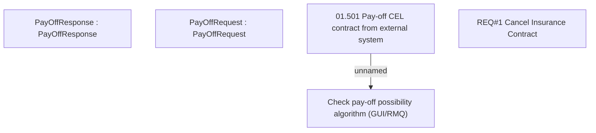

# CBL-25279 (CSI-3642) Automated Tagging for Standalone Insurance contracts into Cancelled Status

- **Diagram Type**: Custom
- **Package**: HomerSelect/BSL/Requirements Model/Finished/CSI/CBL-25279 (CSI-3642) Automated Tagging for Standalone Insurance contracts into Cancelled Status
- **Diagram ID**: 159796
- **Elements**: 5
- **Connectors**: 1

