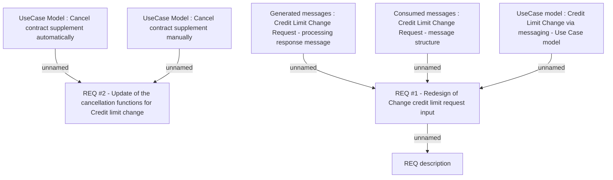

# CBL-8448 (CSI-29) Automated CLIP process for VN country

- **Diagram Type**: Custom
- **Package**: HomerSelect/BSL/Requirements Model/Finished/CSI/CBL-8448 (CSI-29) Automated CLIP process for VN country
- **Diagram ID**: 131016
- **Elements**: 8
- **Connectors**: 6

