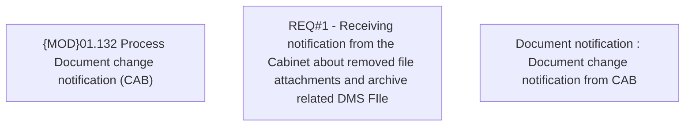

# CBL-9294 (CSI-116) Process cabinet identifier in API request

- **Diagram Type**: Custom
- **Package**: HomerSelect/BSL/Requirements Model/Finished/CSI/CBL-9294 (CSI-116) Process cabinet identifier in API request
- **Diagram ID**: 136456
- **Elements**: 3
- **Connectors**: 0

