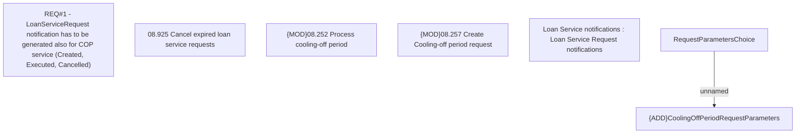

# CBL-9870 (CSI-92) COP Event information - Loan Service Request JMS

```mermaid
graph TD
    REQ_1_LoanServiceRequest_notification_has_to_be_generated_al["REQ#1 - LoanServiceRequest notification has to be generated also for COP service (Created, Executed, Cancelled)"]
    n_08_925_Cancel_expired_loan_service_requests["08.925 Cancel expired loan service requests"]
    MOD_08_252_Process_cooling_off_period["{MOD}08.252 Process cooling-off period"]
    MOD_08_257_Create_Cooling_off_period_request["{MOD}08.257 Create Cooling-off period request"]
    Loan_Service_notifications_Loan_Service_Request_notification["Loan Service notifications : Loan Service Request notifications"]
    RequestParametersChoice["RequestParametersChoice"]
    ADD_CoolingOffPeriodRequestParameters["{ADD}CoolingOffPeriodRequestParameters"]
    RequestParametersChoice -->|unnamed| ADD_CoolingOffPeriodRequestParameters
```
